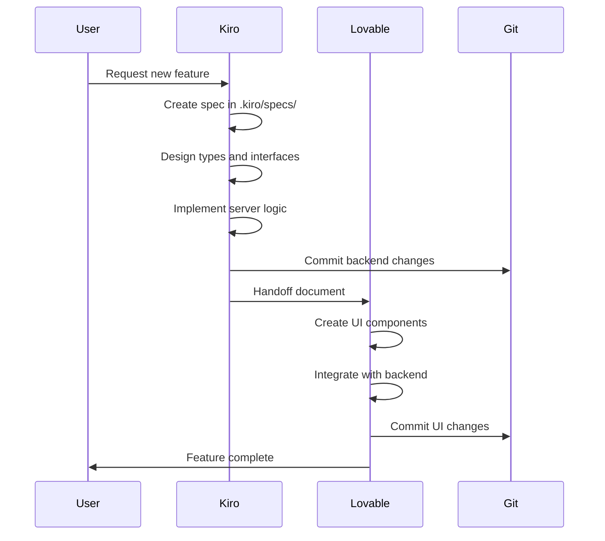
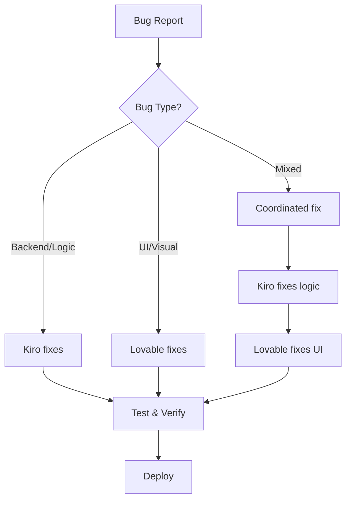

# Coordination Workflows - Kiro & Lovable

**Task 29 - Phase 6: Workflow Documentation**

## 📋 Overview

This document describes the step-by-step coordination workflows between Kiro (infrastructure/logic) and Lovable (UI/components).

---

## 🔄 Standard Workflow

### 1. Feature Development Workflow



### 2. Bug Fix Workflow



---

## 🤝 Handoff Process

### Kiro → Lovable Handoff

**When**: After backend changes that require UI updates

**Steps**:
1. Kiro completes backend work
2. Kiro creates handoff document in `.kiro/coordination/handoffs/`
3. Document includes:
   - Summary of changes
   - Modified files
   - New types/interfaces
   - API endpoints
   - Integration points
   - Dependencies
   - Testing notes
4. Lovable reads handoff document
5. Lovable implements UI changes
6. Lovable updates handoff with completion notes

**Template**: See `.kiro/coordination/templates/handoff-template.md`

### Lovable → Kiro Handoff

**When**: After UI changes that need backend support

**Steps**:
1. Lovable completes UI design
2. Lovable creates handoff with:
   - Component structure
   - Props needed
   - Data requirements
   - User interactions
   - Expected API calls
3. Kiro implements backend support
4. Kiro notifies Lovable of completion

---

## 📝 Successful Handoff Examples

### Example 1: Adding Lead Import Feature

**Kiro's Work**:
- Created `src/server/leads-import.functions.ts`
- Defined types in `src/modules/prospecting/types.ts`
- Implemented CSV parsing in `src/server/leads-parser.ts`
- Added error handling with `error-handler.ts`

**Handoff Document**:
```markdown
## Summary
Lead import feature backend complete. Supports CSV files up to 1000 leads.

## Modified Files
- src/server/leads-import.functions.ts (new)
- src/modules/prospecting/types.ts (updated)
- src/server/leads-parser.ts (new)

## New Types
- LeadImportJob
- ParsedLeadData
- ImportStatistics

## Integration Points
- Server function: `importLeadsFromCSV`
- Accepts: FormData with CSV file
- Returns: ImportStatistics

## Next Steps for Lovable
1. Create import dialog component
2. Add file upload with drag-and-drop
3. Show import progress
4. Display statistics after import
```

**Lovable's Work**:
- Created `src/components/buscador/import-leads-dialog.tsx`
- Added drag-and-drop UI
- Integrated with server function
- Added progress indicators

**Result**: Feature delivered successfully with full coordination.

---

### Example 2: Adding CRM Pipeline

**Kiro's Work**:
- Created CRM store (`src/modules/crm/crm-store.ts`)
- Defined pipeline types
- Implemented stage transition logic

**Lovable's Work**:
- Created pipeline visualization
- Added drag-and-drop between stages
- Implemented stage-specific UI

**Coordination**:
- Used store as single source of truth
- Lovable only read from store, never mutated directly
- All mutations went through store actions

---

## ⚠️ Conflict Resolution

### Detection

Conflicts are detected by:
1. **Pre-commit hook**: Checks ownership before commit
2. **Work log**: Tracks active work
3. **CLI tools**: `check-ownership`, `check-conflicts`

### Resolution Steps

#### Scenario 1: Both tools modified same file

1. **Stop**: Do not force push or commit
2. **Identify**: Check git log to see who committed first
3. **Communicate**: Create coordination note
4. **Merge**: 
   - If changes are compatible, merge manually
   - If incompatible, revert newer changes
5. **Coordinate**: One tool continues, other waits

#### Scenario 2: Ownership boundary violation

1. **Review**: Check `.kiro/coordination/ownership.json`
2. **Decide**: 
   - Was the boundary correct?
   - Should file be moved to different ownership?
3. **Update**: Modify ownership.json if needed
4. **Document**: Add note to work-log.md

---

## 🔧 Tools & Commands

### Daily Workflow Commands

```bash
# Check what changes are active
npm run work-log:status

# Verify file ownership
npm run check-ownership

# Check for active conflicts
npm run check-conflicts

# Check recent changes
npm run check-recent-changes

# Run tests before commit
npm run test

# Format code
npm run format

# Check types
npm run typecheck
```

### Git Workflow

```bash
# Before starting work
git pull origin main
npm run check-conflicts

# While working
# (changes tracked in work-log.md)

# Before commit
git add .
# Pre-commit hook runs automatically:
# - check-ownership
# - typecheck
# - lint
# - tests

# Push to feature branch
git push origin feature/my-feature

# Create PR
# (via GitHub UI or CLI)
```

---

## 📊 Coordination Metrics

Track these metrics to measure coordination effectiveness:

- **Merge Conflicts**: Target < 1 per week
- **Failed Handoffs**: Target 0
- **Ownership Violations**: Target 0
- **Pre-commit Hook Failures**: Target < 5%
- **Handoff Turnaround**: Target < 24h

---

## 🚨 Emergency Procedures

### Quick Revert

```bash
# Revert last commit (if not pushed)
git reset --soft HEAD~1

# Revert specific commit
git revert <commit-hash>

# Reset to specific commit
git reset --hard <commit-hash>
```

### Backup Branch Strategy

```bash
# Create backup before major changes
git checkout -b backup/before-refactor-$(date +%Y%m%d)
git push origin backup/before-refactor-$(date +%Y%m%d)
```

---

## 🎓 Best Practices

### For Kiro

✅ **DO**:
- Write comprehensive types before implementation
- Document public APIs
- Write tests for critical logic
- Use structured logging
- Handle errors with user-friendly messages
- Create handoff documents for UI changes

❌ **DON'T**:
- Modify UI components directly
- Change styles or tailwind config
- Skip error handling
- Use `any` type
- Use `console.log` (use logger)

### For Lovable

✅ **DO**:
- Read store state, don't mutate directly
- Use store actions for all mutations
- Follow existing UI patterns
- Use shadcn/ui components
- Keep components focused and small
- Document component props

❌ **DON'T**:
- Modify server functions
- Change type definitions
- Modify backend logic
- Skip accessibility
- Use inline styles

---

## 📚 Related Documents

- [Ownership Rules](./ownership.json)
- [Work Log](./work-log.md)
- [Handoff Template](./templates/handoff-template.md)
- [Module Documentation Template](./templates/module-documentation.md)
- [API Documentation Template](./templates/api-documentation.md)
- [Component Documentation Template](./templates/component-documentation.md)

---

**Last Updated**: 2026-05-12  
**Maintained by**: Kiro & Lovable coordination system
