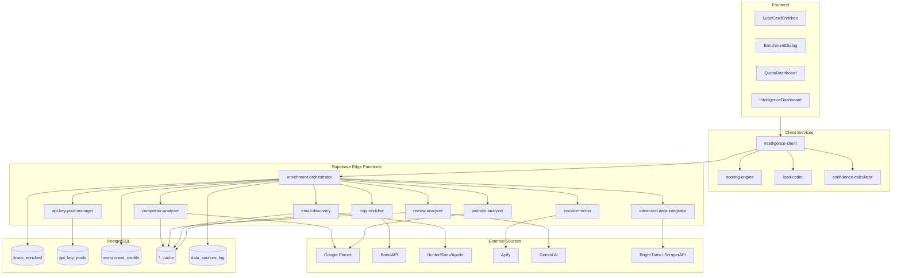
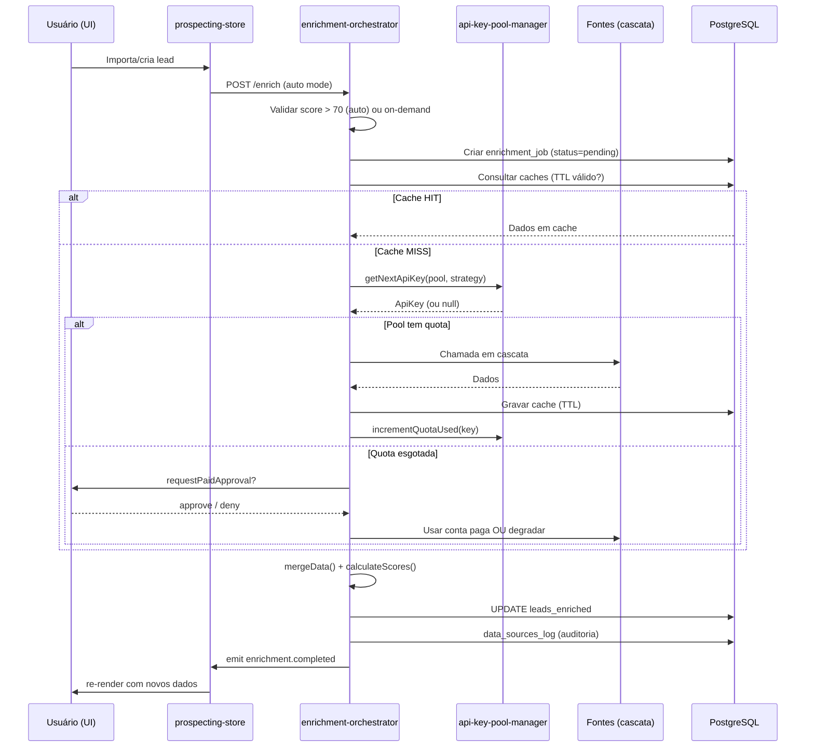
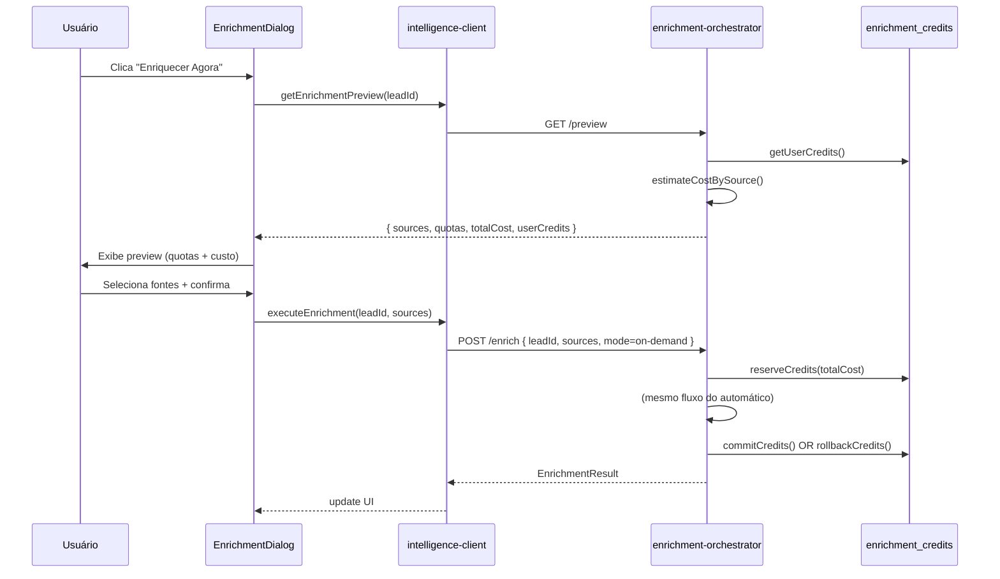
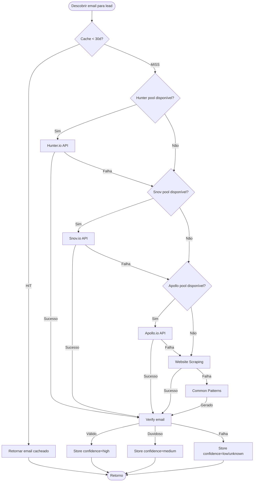

# Design Document — Lead Intelligence Engine

## Overview

O **Lead Intelligence Engine (LIE)** é um subsistema do módulo `/prospecting` responsável por transformar leads básicos (nome, telefone, endereço, rating) em perfis comerciais enriquecidos, scorados, segmentados por confiança e prontos para abordagem multi-canal.

O LIE não substitui o módulo existente, ele **estende** o tipo `ProspectLead`, reutiliza o `prospecting-store.ts` para persistência local e adiciona uma camada de backend orientada a serviços (Supabase Edge Functions e Server Functions) com cache PostgreSQL e pools de API keys com rotação automática.

### Objetivos de Design

1. **Zero breaking changes**: não modificar campos existentes de `ProspectLead` — apenas adicionar novos campos opcionais (`intelligence?: LeadIntelligence`).
2. **Separação entre identidade e dados**: `identity_status` (verificação legal do CNPJ) é independente de `data_confidence` (qualidade dos dados operacionais).
3. **Resiliência por design**: toda fonte de dados tem fallback, circuit breaker e degradação graciosa.
4. **Controle de custo explícito**: APIs pagas exigem aprovação do usuário; pools gratuitos são rotacionados automaticamente.
5. **Testabilidade por propriedades**: todo score, toda serialização e toda rotação de pool é verificável por PBT.

### Princípios Arquiteturais

| Princípio | Consequência |
|-----------|--------------|
| Cascata de fontes | Cada enriquecimento tenta N fontes em ordem decrescente de confiança |
| Cache agressivo | TTL por tipo de dado (emails 30d, reviews 14d, competitors 7d, CNPJ 90d) |
| Pool-first | Gratuito antes de pago; pago só com consentimento explícito |
| Idempotência | Enriquecer o mesmo lead N vezes produz o mesmo resultado (com mesmos dados de entrada) |
| Observabilidade | Todo dado enriquecido carrega `source`, `fetched_at`, `field_confidence` |

### Não-objetivos

- **Não** substituir o CRM existente (LIE é produtor de dados, não gestor de pipeline).
- **Não** implementar IA generativa do zero — reutiliza o serviço Gemini já configurado no `pitch-generator`.
- **Não** implementar scraping dentro do browser do usuário — todo scraping roda em edge functions com proxies.
- **Não** armazenar bases vazadas/ilegais em produção — esses conectores existem apenas como flag "personal_use" desativado por padrão (ver requisito de compliance).

---

## Architecture

### Visão em Camadas

```
┌─────────────────────────────────────────────────────────────────┐
│  Layer 1 — UI (React + Zustand)                                 │
│  ├─ LeadCardEnriched          (badges de confidence)            │
│  ├─ EnrichmentDialog          (seleção de fontes + quotas)      │
│  ├─ QuotaDashboard            (saúde dos pools)                 │
│  ├─ IntelligenceDashboard     (agregados do pipeline)           │
│  ├─ ConfidenceIndicator       (badge por campo)                 │
│  └─ RoutePlannerMap           (rotas porta-a-porta)             │
├─────────────────────────────────────────────────────────────────┤
│  Layer 2 — Client Services (src/modules/prospecting/intel/*)    │
│  ├─ intelligence-client.ts    (API do LIE para a UI)            │
│  ├─ enrichment-orchestrator   (coordena jobs no browser)        │
│  ├─ scoring-engine.ts         (cálculo dos scores — puro)       │
│  ├─ lead-codec.ts             (parse/serialize round-trippable) │
│  └─ confidence-calculator.ts  (agregação de field_confidence)   │
├─────────────────────────────────────────────────────────────────┤
│  Layer 3 — Backend (Supabase Edge Functions)                    │
│  ├─ enrichment-orchestrator   (fan-out por tipo de fonte)       │
│  ├─ email-discovery           (pool Hunter/Snov/Apollo)         │
│  ├─ competitor-analyzer       (Google Places + cache)           │
│  ├─ review-analyzer           (Gemini sentiment)                │
│  ├─ cnpj-enricher             (BrasilAPI + fallback)            │
│  ├─ social-enricher           (Apify Instagram/Facebook)        │
│  ├─ website-analyzer          (PageSpeed + Wappalyzer pool)     │
│  ├─ advanced-data-integrator  (proxy scraping, gov sources)     │
│  └─ api-key-pool-manager      (rotação, quota, circuit breaker) │
├─────────────────────────────────────────────────────────────────┤
│  Layer 4 — Data (PostgreSQL via Supabase)                       │
│  ├─ leads_enriched            (1:1 com prospect_leads)          │
│  ├─ api_key_pools             (multi-conta, rotação)            │
│  ├─ api_key_usage_log         (quota tracking)                  │
│  ├─ enrichment_credits        (créditos por usuário)            │
│  ├─ enrichment_jobs           (jobs em background)              │
│  ├─ data_sources_log          (auditoria de fontes)             │
│  ├─ competitor_cache          (TTL 7d)                          │
│  ├─ review_sentiment_cache    (TTL 14d)                         │
│  ├─ email_discovery_cache     (TTL 30d)                         │
│  ├─ cnpj_cache                (TTL 90d)                         │
│  └─ enrichment_approvals      (consentimentos de API paga)      │
└─────────────────────────────────────────────────────────────────┘
```

### Diagrama de Componentes



### Fluxo de Enriquecimento Automático (lead quente, score > 70)



### Fluxo de Enriquecimento Sob Demanda



### Cascata de Fontes (Email Discovery como exemplo)



### Decisões Arquiteturais (ADRs compactas)

| # | Decisão | Rationale |
|---|---------|-----------|
| 1 | LIE estende `ProspectLead` via campo opcional `intelligence` | Preserva código existente (Req 14) |
| 2 | Edge Functions Supabase ao invés de servidor Node.js dedicado | Integração nativa com Auth/DB, escala automática, custo zero-ocioso |
| 3 | Pool de API keys em DB (não em env) | Multi-conta com rotação dinâmica, auditoria por key |
| 4 | Cache em Postgres com TTL por coluna | Simplifica consulta unificada, permite TTL por tipo de dado |
| 5 | Separar `identity_status` de `data_confidence` | CNPJ válido com dados desatualizados é caso comum (Req 4.7-4.10) |
| 6 | Scoring puro no client (scoring-engine.ts) | Recalculável sem round-trip, testável por PBT |
| 7 | Circuit breaker por `service+key` | Uma key bloqueada não derruba o pool inteiro |
| 8 | Créditos como unidade abstrata (não $) | Separa custo real de custo de UX |

---

## Components and Interfaces

### Client-Side Components (TypeScript)

#### `intelligence-client.ts`

API principal consumida pela UI. Wrapper sobre as edge functions.

```typescript
// src/modules/prospecting/intel/intelligence-client.ts

import type { ProspectLead } from '../types';
import type {
  LeadIntelligence,
  EnrichmentRequest,
  EnrichmentResult,
  EnrichmentPreview,
  QuotaDashboard,
  EnrichmentSource,
} from './intelligence-types';

export interface IntelligenceClient {
  /** Dispara enriquecimento automático (fire-and-forget, retorna jobId). */
  enrichAuto(leadId: string): Promise<{ jobId: string }>;

  /** Enriquecimento on-demand com seleção de fontes. */
  enrichOnDemand(req: EnrichmentRequest): Promise<EnrichmentResult>;

  /** Preview de custo/quotas antes de confirmar. */
  getEnrichmentPreview(leadId: string, sources: EnrichmentSource[]): Promise<EnrichmentPreview>;

  /** Dashboard agregado de quotas de todos os pools. */
  getQuotaDashboard(): Promise<QuotaDashboard>;

  /** Observa progresso de job em background. */
  subscribeJobProgress(jobId: string, onUpdate: (p: JobProgress) => void): Unsubscribe;

  /** Cancela um job em andamento. */
  cancelJob(jobId: string): Promise<void>;

  /** Retry de falhas. */
  retryFailedLeads(jobId: string): Promise<{ jobId: string }>;
}

export type JobProgress = {
  jobId: string;
  total: number;
  processed: number;
  succeeded: number;
  failed: number;
  status: 'pending' | 'running' | 'completed' | 'cancelled' | 'failed';
  errors: Array<{ leadId: string; source: string; message: string }>;
};

export type Unsubscribe = () => void;
```

#### `scoring-engine.ts`

Funções puras. Toda lógica de score é testável sem I/O.

```typescript
// src/modules/prospecting/intel/scoring-engine.ts

import type { LeadIntelligence, ScoreInputs } from './intelligence-types';

/** Score 0-100 ponderado por website, SEO, redes, postagens, tráfego pago. */
export function calculateDigitalMaturityScore(inputs: DigitalMaturityInputs): number;

/** Score 0-100 ponderado por ausências e qualidade baixa (crítico, alto, médio, baixo). */
export function calculateVulnerabilityScore(inputs: VulnerabilityInputs): number;

/** Score 0-100 baseado em idade da empresa, crescimento, expansão. */
export function calculateTimingScore(inputs: TimingInputs): number;

/** Score 0-100 ponderado por completude(30), recência(25), concordância(25), fonte(20). */
export function calculateDataConfidenceScore(inputs: DataConfidenceInputs): number;

/** Score 0-100 % de reviews positivos. */
export function calculateSentimentScore(reviews: AnalyzedReview[]): number;

/** Score 0-100 baseado em maturidade média dos concorrentes. */
export function calculateCompetitivePressureScore(competitors: Competitor[]): number;

/** Score unificado 0-100 = 25% maturity + 30% vulnerability + 25% timing + 20% engagement. */
export function calculateLeadScore(inputs: ScoreInputs): number;

/** Categoriza um score 0-100 em labels humanos. */
export function categorizeScore(score: number, scheme: 'opportunity' | 'maturity' | 'timing' | 'confidence'): string;
```

Todas as funções acima obedecem à propriedade **`0 <= f(x) <= 100`** e são **determinísticas** (mesmo input → mesmo output).

#### `lead-codec.ts`

Parser e pretty-printer round-trippable (Req 18, 19).

```typescript
// src/modules/prospecting/intel/lead-codec.ts

import type { ProspectLead } from '../types';

export type LeadFormat = 'csv' | 'json' | 'txt';

export interface ParseOptions {
  format: LeadFormat;
  delimiter?: string;     // csv
  encoding?: 'utf-8' | 'iso-8859-1';
  txtPattern?: string;    // regex para parser TXT
  fieldMap?: Record<string, keyof ProspectLead>;
}

export interface SerializeOptions {
  format: LeadFormat;
  fields?: (keyof ProspectLead)[];
  pretty?: boolean;
  txtTemplate?: string;
}

export interface ParseResult {
  leads: ProspectLead[];
  errors: Array<{ line: number; field?: string; message: string }>;
}

export function parseLeads(input: string, opts: ParseOptions): ParseResult;
export function serializeLeads(leads: ProspectLead[], opts: SerializeOptions): string;

/** Normaliza telefone para formato BR +55. */
export function normalizePhone(raw: string): string | null;

/** Normaliza endereço removendo caracteres especiais. */
export function normalizeAddress(raw: string): string;
```

**Propriedade round-trip (Req 18.8)**: `parseLeads(serializeLeads(leads, opts), opts).leads ≡ leads`.

#### `confidence-calculator.ts`

```typescript
// src/modules/prospecting/intel/confidence-calculator.ts

export type ConfidenceLevel = 'high' | 'medium' | 'low' | 'unknown';

export interface FieldConfidence<T = unknown> {
  value: T;
  confidence: ConfidenceLevel;
  source: string;
  fetchedAt: string;      // ISO
  agreedSources?: string[]; // fontes que concordam
}

/** Agrega confiança de múltiplas fontes em um único FieldConfidence. */
export function aggregateField<T>(
  observations: Array<{ value: T; source: string; sourceTrust: number; fetchedAt: string }>,
  equals: (a: T, b: T) => boolean,
): FieldConfidence<T>;

/** Rebaixa confiança conforme recência (>90d → -1 nível). */
export function degradeByAge(c: ConfidenceLevel, ageMs: number): ConfidenceLevel;

/** Converte ConfidenceLevel em peso numérico 0-1. */
export function confidenceWeight(c: ConfidenceLevel): number;
```

**Propriedade (Req 5.4, 5.8)**: quando N fontes concordam, a confiança resultante é **monotonicamente não-decrescente** em N.

### Backend Components (Supabase Edge Functions)

#### `enrichment-orchestrator.functions.ts`

```typescript
// supabase/functions/enrichment-orchestrator/index.ts

export interface EnrichmentOrchestratorRequest {
  leadId: string;
  mode: 'auto' | 'on-demand';
  sources: EnrichmentSource[];
  userId: string;
  approvalToken?: string; // necessário se inclui fonte paga
}

export interface EnrichmentOrchestratorResponse {
  jobId: string;
  leadId: string;
  results: Record<EnrichmentSource, SourceResult>;
  scores: ComputedScores;
  identityStatus: IdentityStatus;
  dataConfidence: ConfidenceLevel;
  creditsUsed: number;
  creditsRemaining: number;
}

type SourceResult =
  | { status: 'ok'; data: unknown; source: string; confidence: ConfidenceLevel; fetchedAt: string }
  | { status: 'cache_hit'; data: unknown; cachedAt: string }
  | { status: 'quota_exceeded'; requiresApproval: true }
  | { status: 'failed'; error: string; retryable: boolean }
  | { status: 'skipped'; reason: string };
```

Orquestra chamadas paralelas (`Promise.allSettled`), mergeia, persiste e loga.

#### `api-key-pool-manager.functions.ts`

```typescript
// supabase/functions/api-key-pool-manager/index.ts

export type RotationStrategy = 'round-robin' | 'least-used' | 'random';

export interface ApiKeyPool {
  service: 'hunter' | 'snov' | 'apollo' | 'builtwith' | 'wappalyzer' | 'apify_instagram' | 'apify_maps' | 'apify_facebook';
  keys: ApiKey[];
  rotationStrategy: RotationStrategy;
  paidFallbackKey?: string;
}

export interface ApiKey {
  id: string;
  service: string;
  key: string;
  email: string;
  quotaLimit: number;
  quotaUsed: number;
  quotaResetAt: string;
  status: 'active' | 'quota_exceeded' | 'blocked' | 'expired' | 'circuit_open';
  lastUsedAt: string;
  circuitOpenUntil?: string; // circuit breaker
}

/** Seleciona próxima key respeitando strategy. Retorna null se tudo esgotado. */
export function getNextApiKey(pool: ApiKeyPool): ApiKey | null;

/** Incrementa uso e persiste. Atômico via transação. */
export function incrementQuotaUsed(keyId: string): Promise<void>;

/** Marca circuit como aberto por duração (default 15min). */
export function openCircuit(keyId: string, durationMs?: number): Promise<void>;

/** Executa reset de quotas por cron (diário/mensal conforme key). */
export function resetQuotas(): Promise<{ resetCount: number }>;
```

#### `email-discovery.functions.ts`

```typescript
// supabase/functions/email-discovery/index.ts

export type EmailConfidence = 'high' | 'medium' | 'low' | 'unknown';

export interface DiscoveredEmail {
  email: string;
  source: 'hunter' | 'snov' | 'apollo' | 'scraping' | 'pattern' | 'alternative';
  confidence: EmailConfidence;
  verified: boolean;
  verifiedAt?: string;
  discoveredAt: string;
}

export async function discoverEmail(lead: ProspectLead): Promise<DiscoveredEmail | null>;

/** Gera padrões comuns (contato@, vendas@, firstname@). */
export function generateCommonEmailPatterns(lead: ProspectLead): string[];

/** Valida formato (regex) + verify via EmailListVerify/SMTP. */
export async function verifyEmail(email: string): Promise<{ valid: boolean; deliverable: boolean }>;
```

#### Outros componentes backend (assinaturas compactas)

```typescript
// competitor-analyzer
export async function analyzeCompetitors(lead: ProspectLead, radiusKm?: number): Promise<CompetitorAnalysis>;

// review-analyzer
export async function analyzeReviews(lead: ProspectLead, maxReviews?: number): Promise<ReviewAnalysis>;

// cnpj-enricher
export async function enrichByCnpj(cnpj: string): Promise<CnpjEnrichmentResult>;

// social-enricher
export async function enrichSocial(lead: ProspectLead): Promise<SocialEnrichmentResult>;

// website-analyzer
export async function analyzeWebsite(url: string): Promise<WebsiteAnalysis>;

// advanced-data-integrator
export async function integrateAdvanced(lead: ProspectLead, sources: AdvancedSource[]): Promise<AdvancedEnrichmentResult>;
```

### UI Components (Wireframes)

#### `LeadCardEnriched.tsx`

```
┌──────────────────────────────────────────────────────┐
│ 🏢 Clínica Bella Vita                    [Score 82]  │
│    CNPJ ✅ verificado  •  Dados 🟡 medium            │
├──────────────────────────────────────────────────────┤
│ 📧 contato@bellavita.com.br          🟢 high         │
│ 📱 @bellavita_sp (12.4k)             🟢 high         │
│ 🌐 bellavita.com.br (velocidade 2.8s) 🟡 medium      │
│ 💬 78% reviews positivos              🟢 high        │
├──────────────────────────────────────────────────────┤
│ 🎯 Maturity 65  │ ⚠ Vulnerability 72 │ 🔥 Timing 85  │
│ 🧭 Pressure 40  │ 😊 Sentiment 78    │ 🔒 Confidence 72│
├──────────────────────────────────────────────────────┤
│ [🔍 Enriquecer]  [📊 Dashboard]  [🗺️ Rota]           │
└──────────────────────────────────────────────────────┘
```

Props:

```typescript
interface LeadCardEnrichedProps {
  lead: ProspectLead & { intelligence?: LeadIntelligence };
  onEnrichClick: () => void;
  onOpenIntelligence: () => void;
  onAddToRoute?: () => void;
  showConfidenceBadges?: boolean; // default true
}
```

#### `EnrichmentDialog.tsx`

```
┌────────────────────────────────────────────────────┐
│ Enriquecer: Clínica Bella Vita              [X]    │
├────────────────────────────────────────────────────┤
│ ☑ Email Discovery                                  │
│   Hunter (15/250) • Snov (32/500) • Scraping       │
│   Custo: 1 crédito                                 │
│                                                    │
│ ☑ Instagram Completo                               │
│   Apify (45/100)                                   │
│   Custo: 1 crédito                                 │
│                                                    │
│ ☑ Análise Competitiva                              │
│   Google Places (78/100)                           │
│   Custo: 5 créditos                                │
│                                                    │
│ ☐ Reviews Sentiment                                │
│   Gemini (gratuito)                                │
│   Custo: 0 créditos                                │
│                                                    │
│ ────────────────────────────────                   │
│ Total: 7 créditos  •  Saldo: 150                   │
│                                                    │
│          [Cancelar]  [Enriquecer Agora]            │
└────────────────────────────────────────────────────┘
```

#### `QuotaDashboard.tsx`

Painel com barra de progresso por pool:

```
Hunter.io    ████████░░░░░░░░░░░░  15/250    reset 2026-06-01
Snov.io      ████░░░░░░░░░░░░░░░░  32/500    reset 2026-06-01
Apollo.io    ██░░░░░░░░░░░░░░░░░░  8/100     reset 2026-06-01
Apify IG     █████████░░░░░░░░░░░  45/100    reset em 4h
Apify Maps   ██████████░░░░░░░░░░  256/500   reset em 4h
Google Places ████████████████░░░░  78/100   reset em 4h  ⚠
```

#### `IntelligenceDashboard.tsx`

Agregados por nicho/cidade/score/confidence (Req 16). Usa Recharts (já no projeto).

#### `ConfidenceIndicator.tsx`

Componente atômico — badge colorido:

```typescript
interface ConfidenceIndicatorProps {
  level: ConfidenceLevel;
  source?: string;
  fetchedAt?: string;
  compact?: boolean;
}
```

### Fluxo de Usuário (Jornada do Vendedor)

1. **Importa/cria lead** no módulo de prospecção (comportamento atual).
2. **Job de enriquecimento automático** dispara em background para leads com score > 70.
3. Card exibe **badges de confidence** conforme dados chegam (Realtime via Supabase).
4. Para leads mornos/frios, vendedor clica **"Enriquecer Agora"** → vê preview de custo → confirma.
5. Vendedor vê **inteligência consolidada**: pain points, ofertas, scripts, concorrentes, reviews.
6. Monta **rota porta-a-porta** selecionando leads geograficamente próximos.
7. Dispara **cold email** / **WhatsApp** em lote com mensagens personalizadas.
8. Registra **objeções reais** → sistema aprende e melhora sugestões.
9. Acompanha **QuotaDashboard** para evitar esgotar pools gratuitos.

---

## Data Models

### TypeScript — Tipos Exportados

```typescript
// src/modules/prospecting/intel/intelligence-types.ts

import type { ProspectLead } from '../types';

// === CONFIDENCE & IDENTITY ===

export type ConfidenceLevel = 'high' | 'medium' | 'low' | 'unknown';

export type IdentityStatus = 'verified' | 'invalid_cnpj' | 'not_found';

export interface FieldConfidence<T = unknown> {
  value: T;
  confidence: ConfidenceLevel;
  source: string;
  fetchedAt: string;         // ISO 8601
  agreedSources?: string[];
}

// === SCORES ===

export interface ComputedScores {
  leadScore: number;                    // 0-100
  digitalMaturityScore: number;         // 0-100
  vulnerabilityScore: number;           // 0-100
  timingScore: number;                  // 0-100
  dataConfidenceScore: number;          // 0-100
  sentimentScore?: number;              // 0-100
  competitivePressureScore?: number;    // 0-100
  computedAt: string;
  scoreVersion: string;                 // para re-cálculo em migração
}

export interface ScoreHistoryEntry {
  at: string;
  scores: ComputedScores;
  reason: 'initial' | 'enrichment' | 'manual' | 'migration';
}

// === ENRICHED FIELDS ===

export interface DigitalMaturity {
  hasWebsite: FieldConfidence<boolean>;
  websiteSpeedMs?: FieldConfidence<number>;
  websiteTech?: FieldConfidence<string[]>;      // ['wordpress', 'react', ...]
  seoQuality?: FieldConfidence<'poor' | 'fair' | 'good' | 'excellent'>;
  hasInstagram: FieldConfidence<boolean>;
  instagramFollowers?: FieldConfidence<number>;
  lastPostAt?: FieldConfidence<string>;
  hasFacebook?: FieldConfidence<boolean>;
  hasLinkedIn?: FieldConfidence<boolean>;
  usesPaidAds?: FieldConfidence<boolean>;
  postFrequencyPerMonth?: FieldConfidence<number>;
  category: 'Inexistente' | 'Básica' | 'Intermediária' | 'Avançada';
}

export interface VulnerabilityFinding {
  id: string;
  severity: 'crítica' | 'alta' | 'média' | 'baixa';
  kind: 'no_website' | 'slow_website' | 'weak_seo' | 'no_social' | 'no_automation' | 'inconsistent_branding' | string;
  description: string;
  impact: string;
}

export interface TimingSignals {
  ageMonths?: FieldConfidence<number>;
  followerGrowth3mPct?: FieldConfidence<number>;
  reviewGrowth3mPct?: FieldConfidence<number>;
  recentExpansion?: FieldConfidence<boolean>;
  onlineMentionsTrend?: FieldConfidence<'rising' | 'flat' | 'declining'>;
  category: 'Frio' | 'Morno' | 'Quente' | 'Urgente';
}

export interface CnpjEnrichmentResult {
  identityStatus: IdentityStatus;
  razaoSocial?: FieldConfidence<string>;
  nomeFantasia?: FieldConfidence<string>;
  dataAbertura?: FieldConfidence<string>;
  ageMonths?: FieldConfidence<number>;
  porte?: FieldConfidence<'MEI' | 'ME' | 'EPP' | 'GRANDE'>;
  cnaePrincipal?: FieldConfidence<string>;
  atividadeEconomica?: FieldConfidence<string>;
  enderecoCompleto?: FieldConfidence<string>;
  situacaoCadastral?: FieldConfidence<string>;
  fetchedAt: string;
  source: 'brasilapi' | 'receitaws' | 'cache';
}

export interface EmailDiscoveryResult {
  primary?: DiscoveredEmail;
  candidates: DiscoveredEmail[];
}

export interface DiscoveredEmail {
  email: string;
  source: 'hunter' | 'snov' | 'apollo' | 'scraping' | 'pattern' | 'alternative';
  confidence: ConfidenceLevel;
  verified: boolean;
  verifiedAt?: string;
  discoveredAt: string;
}

export interface Competitor {
  placeId: string;
  name: string;
  rating: number;
  reviewCount: number;
  distanceKm: number;
  hasWebsite: boolean;
  hasInstagram: boolean;
  maturityScore: number;
}

export interface CompetitorAnalysis {
  competitors: Competitor[];
  nicheAverage: { rating: number; reviewCount: number };
  leadRanking: number;              // posição do lead vs concorrentes
  threats: Competitor[];            // rating superior
  opportunities: Competitor[];      // rating inferior
  digitalGap: { withWebsite: number; withInstagram: number };
  competitiveInsight: string;       // texto para pitch
  competitivePressureScore: number;
  cachedAt: string;
}

export interface AnalyzedReview {
  text: string;
  rating: number;
  createdAt: string;
  sentiment: 'positive' | 'neutral' | 'negative';
  themes: string[];                 // ['atendimento', 'preço', 'qualidade']
  mentionsCompetitor?: string;
}

export interface ReviewAnalysis {
  reviews: AnalyzedReview[];
  sentimentScore: number;           // 0-100
  trend: 'improving' | 'declining' | 'stable';
  painPoints: string[];             // até 10
  strengths: string[];              // até 10
  recurringThemes: Array<{ theme: string; count: number; sentiment: string }>;
  reviewInsight: string;            // texto para pitch
  cachedAt: string;
}

export interface SalesIntelligence {
  painPoints: string[];             // até 5
  personalizedOffers: Array<{
    headline: string;
    description: string;
    estimatedValue: number;
    addresses: string[];            // pain points endereçados
  }>;
  approachScripts: {
    whatsapp: string;
    email: { subject: string; body: string };
    inPerson: string;
  };
  bestContactWindow: { dayOfWeek: string; hourRange: string };
  bestChannel: 'whatsapp' | 'email' | 'instagram' | 'inPerson';
  likelyObjections: Array<{
    kind: 'price' | 'timing' | 'trust' | 'need';
    objection: string;
    suggestedResponse: string;
    socialProof?: string;
  }>;
  estimatedDealValue: number;
  closingProbability: number;       // 0-100
}

// === CONTAINER PRINCIPAL ===

export interface LeadIntelligence {
  leadId: string;
  scoreVersion: string;
  identityStatus: IdentityStatus;
  dataConfidence: ConfidenceLevel;
  scores: ComputedScores;
  scoreHistory: ScoreHistoryEntry[];
  digitalMaturity?: DigitalMaturity;
  vulnerabilities: VulnerabilityFinding[];
  timing?: TimingSignals;
  cnpj?: CnpjEnrichmentResult;
  email?: EmailDiscoveryResult;
  competitorAnalysis?: CompetitorAnalysis;
  reviewAnalysis?: ReviewAnalysis;
  salesIntelligence?: SalesIntelligence;
  enrichedAt: string;
  lastSources: Record<string, { source: string; fetchedAt: string }>;
}

// === ENRICHMENT API ===

export type EnrichmentSource =
  | 'cnpj'
  | 'email_discovery'
  | 'social_instagram'
  | 'social_facebook'
  | 'website_analysis'
  | 'competitor_analysis'
  | 'review_sentiment'
  | 'advanced_data'
  | 'sales_intelligence';

export interface EnrichmentRequest {
  leadId: string;
  mode: 'auto' | 'on-demand';
  sources: EnrichmentSource[];
  userId: string;
  approvalToken?: string;
}

export interface EnrichmentPreview {
  sources: Array<{
    source: EnrichmentSource;
    cost: number;
    availableQuota: number;
    requiresPaidApproval: boolean;
    estimatedDurationMs: number;
  }>;
  totalCost: number;
  userCredits: number;
  canExecute: boolean;
  blockedReason?: string;
}

export interface EnrichmentResult {
  jobId: string;
  leadId: string;
  intelligence: LeadIntelligence;
  creditsUsed: number;
  creditsRemaining: number;
  warnings: string[];
}

// === EXTENSÃO DO ProspectLead ===

declare module '../types' {
  interface ProspectLead {
    intelligence?: LeadIntelligence;
  }
}
```

### Schemas SQL

```sql
-- ============================================
-- leads_enriched: 1:1 com prospect_leads
-- ============================================
CREATE TABLE leads_enriched (
  lead_id UUID PRIMARY KEY REFERENCES prospect_leads(id) ON DELETE CASCADE,
  user_id UUID NOT NULL REFERENCES auth.users(id) ON DELETE CASCADE,
  intelligence JSONB NOT NULL,              -- LeadIntelligence serializado
  identity_status TEXT NOT NULL
    CHECK (identity_status IN ('verified', 'invalid_cnpj', 'not_found')),
  data_confidence TEXT NOT NULL
    CHECK (data_confidence IN ('high', 'medium', 'low', 'unknown')),
  lead_score SMALLINT NOT NULL CHECK (lead_score BETWEEN 0 AND 100),
  digital_maturity_score SMALLINT NOT NULL CHECK (digital_maturity_score BETWEEN 0 AND 100),
  vulnerability_score SMALLINT NOT NULL CHECK (vulnerability_score BETWEEN 0 AND 100),
  timing_score SMALLINT NOT NULL CHECK (timing_score BETWEEN 0 AND 100),
  data_confidence_score SMALLINT NOT NULL CHECK (data_confidence_score BETWEEN 0 AND 100),
  sentiment_score SMALLINT CHECK (sentiment_score BETWEEN 0 AND 100),
  competitive_pressure_score SMALLINT CHECK (competitive_pressure_score BETWEEN 0 AND 100),
  score_version TEXT NOT NULL DEFAULT 'v1',
  enriched_at TIMESTAMPTZ NOT NULL DEFAULT now(),
  updated_at TIMESTAMPTZ NOT NULL DEFAULT now()
);

CREATE INDEX idx_leads_enriched_user         ON leads_enriched(user_id);
CREATE INDEX idx_leads_enriched_lead_score   ON leads_enriched(lead_score DESC);
CREATE INDEX idx_leads_enriched_timing       ON leads_enriched(timing_score DESC);
CREATE INDEX idx_leads_enriched_confidence   ON leads_enriched(data_confidence);
CREATE INDEX idx_leads_enriched_identity     ON leads_enriched(identity_status);
CREATE INDEX idx_leads_enriched_updated_at   ON leads_enriched(updated_at);
CREATE INDEX idx_leads_enriched_jsonb_gin    ON leads_enriched USING GIN (intelligence jsonb_path_ops);

-- RLS
ALTER TABLE leads_enriched ENABLE ROW LEVEL SECURITY;
CREATE POLICY leads_enriched_owner ON leads_enriched
  USING (auth.uid() = user_id) WITH CHECK (auth.uid() = user_id);

-- ============================================
-- api_key_pools: Pools multi-conta com rotação
-- ============================================
CREATE TABLE api_key_pools (
  id UUID PRIMARY KEY DEFAULT gen_random_uuid(),
  service TEXT NOT NULL,                    -- hunter | snov | apollo | builtwith | wappalyzer | apify_*
  rotation_strategy TEXT NOT NULL DEFAULT 'least-used'
    CHECK (rotation_strategy IN ('round-robin','least-used','random')),
  paid_fallback_key_encrypted TEXT,         -- pgcrypto
  created_at TIMESTAMPTZ NOT NULL DEFAULT now(),
  UNIQUE (service)
);

CREATE TABLE api_keys (
  id UUID PRIMARY KEY DEFAULT gen_random_uuid(),
  pool_id UUID NOT NULL REFERENCES api_key_pools(id) ON DELETE CASCADE,
  service TEXT NOT NULL,
  key_encrypted TEXT NOT NULL,              -- pgp_sym_encrypt
  account_email TEXT,
  quota_limit INTEGER NOT NULL,
  quota_used INTEGER NOT NULL DEFAULT 0,
  quota_reset_at TIMESTAMPTZ NOT NULL,
  status TEXT NOT NULL DEFAULT 'active'
    CHECK (status IN ('active','quota_exceeded','blocked','expired','circuit_open')),
  circuit_open_until TIMESTAMPTZ,
  last_used_at TIMESTAMPTZ,
  created_at TIMESTAMPTZ NOT NULL DEFAULT now()
);

CREATE INDEX idx_api_keys_pool_status ON api_keys(pool_id, status) WHERE status = 'active';
CREATE INDEX idx_api_keys_quota_reset ON api_keys(quota_reset_at);

-- ============================================
-- api_key_usage_log: auditoria e rate metrics
-- ============================================
CREATE TABLE api_key_usage_log (
  id BIGSERIAL PRIMARY KEY,
  key_id UUID NOT NULL REFERENCES api_keys(id) ON DELETE CASCADE,
  service TEXT NOT NULL,
  called_at TIMESTAMPTZ NOT NULL DEFAULT now(),
  status_code INTEGER,
  response_time_ms INTEGER,
  success BOOLEAN NOT NULL,
  error_message TEXT
);

CREATE INDEX idx_api_usage_key_time ON api_key_usage_log(key_id, called_at DESC);
CREATE INDEX idx_api_usage_service_time ON api_key_usage_log(service, called_at DESC);

-- ============================================
-- enrichment_credits: saldo por usuário
-- ============================================
CREATE TABLE enrichment_credits (
  user_id UUID PRIMARY KEY REFERENCES auth.users(id) ON DELETE CASCADE,
  balance INTEGER NOT NULL DEFAULT 0 CHECK (balance >= 0),
  monthly_allowance INTEGER NOT NULL DEFAULT 100,
  reserved INTEGER NOT NULL DEFAULT 0 CHECK (reserved >= 0),
  last_refill_at TIMESTAMPTZ NOT NULL DEFAULT now(),
  updated_at TIMESTAMPTZ NOT NULL DEFAULT now()
);

CREATE TABLE enrichment_credit_transactions (
  id UUID PRIMARY KEY DEFAULT gen_random_uuid(),
  user_id UUID NOT NULL REFERENCES auth.users(id) ON DELETE CASCADE,
  delta INTEGER NOT NULL,                   -- negativo = débito
  reason TEXT NOT NULL,                     -- 'enrichment' | 'refill' | 'refund' | 'adjustment'
  job_id UUID,
  created_at TIMESTAMPTZ NOT NULL DEFAULT now()
);

CREATE INDEX idx_credit_tx_user_time ON enrichment_credit_transactions(user_id, created_at DESC);

-- ============================================
-- enrichment_jobs: jobs em background
-- ============================================
CREATE TABLE enrichment_jobs (
  id UUID PRIMARY KEY DEFAULT gen_random_uuid(),
  user_id UUID NOT NULL REFERENCES auth.users(id) ON DELETE CASCADE,
  mode TEXT NOT NULL CHECK (mode IN ('auto','on-demand','batch')),
  status TEXT NOT NULL DEFAULT 'pending'
    CHECK (status IN ('pending','running','completed','cancelled','failed')),
  lead_ids UUID[] NOT NULL,
  sources TEXT[] NOT NULL,
  total INTEGER NOT NULL,
  processed INTEGER NOT NULL DEFAULT 0,
  succeeded INTEGER NOT NULL DEFAULT 0,
  failed INTEGER NOT NULL DEFAULT 0,
  errors JSONB NOT NULL DEFAULT '[]'::jsonb,
  started_at TIMESTAMPTZ,
  completed_at TIMESTAMPTZ,
  created_at TIMESTAMPTZ NOT NULL DEFAULT now()
);

CREATE INDEX idx_enrichment_jobs_user_status ON enrichment_jobs(user_id, status, created_at DESC);

-- ============================================
-- data_sources_log: auditoria por campo
-- ============================================
CREATE TABLE data_sources_log (
  id BIGSERIAL PRIMARY KEY,
  lead_id UUID NOT NULL REFERENCES prospect_leads(id) ON DELETE CASCADE,
  field_name TEXT NOT NULL,
  source TEXT NOT NULL,                     -- api_oficial | scraping | pool_hunter | base_alternativa | ...
  source_trust NUMERIC(3,2) NOT NULL,       -- 0.00 - 1.00
  confidence TEXT NOT NULL CHECK (confidence IN ('high','medium','low','unknown')),
  fetched_at TIMESTAMPTZ NOT NULL DEFAULT now(),
  raw_response JSONB
);

CREATE INDEX idx_data_sources_lead_field ON data_sources_log(lead_id, field_name, fetched_at DESC);

-- ============================================
-- Caches com TTL por tipo
-- ============================================
CREATE TABLE cnpj_cache (
  cnpj TEXT PRIMARY KEY,
  payload JSONB NOT NULL,
  identity_status TEXT NOT NULL,
  cached_at TIMESTAMPTZ NOT NULL DEFAULT now(),
  expires_at TIMESTAMPTZ NOT NULL DEFAULT (now() + INTERVAL '90 days')
);
CREATE INDEX idx_cnpj_cache_expires ON cnpj_cache(expires_at);

CREATE TABLE email_discovery_cache (
  cache_key TEXT PRIMARY KEY,               -- hash(companyName+domain)
  payload JSONB NOT NULL,
  cached_at TIMESTAMPTZ NOT NULL DEFAULT now(),
  expires_at TIMESTAMPTZ NOT NULL DEFAULT (now() + INTERVAL '30 days')
);
CREATE INDEX idx_email_cache_expires ON email_discovery_cache(expires_at);

CREATE TABLE competitor_cache (
  cache_key TEXT PRIMARY KEY,               -- hash(niche+geohash+radius)
  payload JSONB NOT NULL,
  cached_at TIMESTAMPTZ NOT NULL DEFAULT now(),
  expires_at TIMESTAMPTZ NOT NULL DEFAULT (now() + INTERVAL '7 days')
);
CREATE INDEX idx_competitor_cache_expires ON competitor_cache(expires_at);

CREATE TABLE review_sentiment_cache (
  place_id TEXT PRIMARY KEY,
  payload JSONB NOT NULL,
  cached_at TIMESTAMPTZ NOT NULL DEFAULT now(),
  expires_at TIMESTAMPTZ NOT NULL DEFAULT (now() + INTERVAL '14 days')
);
CREATE INDEX idx_review_cache_expires ON review_sentiment_cache(expires_at);

-- ============================================
-- enrichment_approvals: consentimentos de API paga
-- ============================================
CREATE TABLE enrichment_approvals (
  id UUID PRIMARY KEY DEFAULT gen_random_uuid(),
  user_id UUID NOT NULL REFERENCES auth.users(id) ON DELETE CASCADE,
  service TEXT NOT NULL,
  scope TEXT NOT NULL,                      -- 'one-time' | 'session' | 'always'
  expires_at TIMESTAMPTZ,
  approved_at TIMESTAMPTZ NOT NULL DEFAULT now(),
  revoked_at TIMESTAMPTZ
);

CREATE INDEX idx_approvals_user_service ON enrichment_approvals(user_id, service) WHERE revoked_at IS NULL;

-- ============================================
-- Jobs de manutenção (cron)
-- ============================================
-- reset de quotas (executado por pg_cron ou edge scheduled function)
-- DELETE FROM *_cache WHERE expires_at < now();
-- UPDATE api_keys SET quota_used = 0 WHERE quota_reset_at < now();
```

### Estratégia de Cache

| Dado | TTL | Chave | Invalidação |
|------|-----|-------|-------------|
| CNPJ | 90 dias | `cnpj` | Manual via botão "Atualizar CNPJ" |
| Email Discovery | 30 dias | `hash(company + domain)` | Ao detectar bounce |
| Competitors | 7 dias | `hash(niche + geohash + radius)` | Mudança de endereço do lead |
| Review Sentiment | 14 dias | `place_id` | Mudança grande no review count |
| Website Analysis | 7 dias | `hash(url)` | Manual |
| Social Instagram | 3 dias | `instagram_handle` | Mudança de handle |

**Camadas**:
1. **L1 — In-memory** (edge function, TTL 5min): evita queries repetidas no mesmo job.
2. **L2 — Postgres** (TTL por tabela): compartilhado entre jobs e usuários.
3. **L3 — Cliente** (Zustand + `persist`): reduz re-fetch na UI.

Cache é **consistente**: mesmo input → mesma chave → mesmo valor até expiração.


---

## Correctness Properties

*A property is a characteristic or behavior that should hold true across all valid executions of a system — essentially, a formal statement about what the system should do. Properties serve as the bridge between human-readable specifications and machine-verifiable correctness guarantees.*

PBT se aplica ao LIE. A maior parte do sistema é composta por **funções puras** (scoring, parsing, rotação de pool, agregação de confiança, validação) com propriedades universais sobre grandes espaços de entrada. Fontes externas são mockáveis, tornando viável rodar 100+ iterações por propriedade. As propriedades abaixo foram derivadas e consolidadas a partir da análise de prework acima.

### Property 1: Score Bounds

*For any* entrada válida fornecida aos cálculos de score (`calculateLeadScore`, `calculateDigitalMaturityScore`, `calculateVulnerabilityScore`, `calculateTimingScore`, `calculateDataConfidenceScore`, `calculateSentimentScore`, `calculateCompetitivePressureScore`), o valor retornado deve satisfazer `0 <= score <= 100` e ser um inteiro finito.

**Validates: Requirements 2.8, 3.7, 5.1, 6.6, 7.1, 20.1, 20.2, 20.3, 20.4, 20.5, 23.11, 24.7**

### Property 2: Score Monotonicity

*For any* estado de lead `s` e qualquer sinal positivo `p` adicionado a esse estado, `score(s ∪ {p}) >= score(s)` para os scores de maturidade, timing e lead unificado; simetricamente, para vulnerabilidade, adicionar uma vulnerabilidade nunca diminui `vulnerabilityScore`.

**Validates: Requirements 2.8, 3.7, 6.2, 6.3, 6.4, 6.5, 6.6, 7.2, 7.3, 7.4, 7.5, 23.11**

### Property 3: Score Categorization Totality

*For any* valor de score `x ∈ [0,100]`, a função `categorizeScore(x, scheme)` retorna exatamente uma das labels definidas para o scheme; além disso, se `x1 <= x2` então a label de `x1` tem rank monotonicamente não-decrescente em relação à de `x2`.

**Validates: Requirements 2.9, 5.6, 6.7, 7.6**

### Property 4: Score Idempotency

*For any* lead `L` e entrada externa fixa `E` (caches populados, respostas mockadas), executar `enrich(L, E)` duas vezes consecutivas produz `LeadIntelligence` cujos scores, `identity_status`, `data_confidence` e `field_confidence` de todos os campos são idênticos (`enrich(enrich(L, E), E) ≡ enrich(L, E)`).

**Validates: Requirements 7.7, 15.5**

### Property 5: Codec Round-Trip

*For any* lista de leads `L` válidos e opções `opts ∈ {csv, json, txt}` compatíveis, `parseLeads(serializeLeads(L, opts), opts).leads` é equivalente a `L` por uma função de igualdade que desconsidera formatação de whitespace e ordem de chaves em JSON.

**Validates: Requirements 17.1-17.8, 18.1-18.8, 19.1-19.7**

### Property 6: Identity and Data Confidence Independence

*For any* resultado de enriquecimento, `identity_status ∈ {verified, invalid_cnpj, not_found}` e `data_confidence ∈ {high, medium, low, unknown}` são atribuíveis independentemente. Em particular, existe um caminho de execução válido para cada uma das 12 combinações possíveis, e mudar um não força mudar o outro.

**Validates: Requirements 4.7, 4.8, 4.9, 4.10, 20.6, 20.7, 20.8**

### Property 7: Confidence Monotonicity on Agreement

*For any* campo com observações de múltiplas fontes, se `k` fontes distintas concordam no mesmo valor, a confiança agregada é monotonicamente não-decrescente em `k`. Além disso, quando ao menos duas fontes discordam, a confiança do campo é **no máximo** `low`.

**Validates: Requirements 5.4, 5.7, 5.8**

### Property 8: Confidence Age Degradation

*For any* observação com idade `age_ms` e confiança inicial `c`, `degradeByAge(c, age_ms)` rebaixa a confiança em um nível quando `age_ms >= 90 dias` e a mantém inalterada quando `age_ms < 90 dias`. A degradação nunca sobe de nível.

**Validates: Requirement 5.9**

### Property 9: Field Observability

*For any* campo enriquecido `f` presente em um `LeadIntelligence`, `f` carrega um `source` não-vazio e um `fetchedAt` que é um timestamp ISO 8601 válido. Nenhum campo enriquecido pode existir sem estes metadados.

**Validates: Requirements 1.7, 22.10, 25.14**

### Property 10: Orchestrator Fault Tolerance

*For any* lead e qualquer máscara de falha aplicada às fontes da cascata (um subconjunto arbitrário de fontes falha com erro simulado), o `enrichment-orchestrator` nunca lança exceção não-tratada e retorna um `EnrichmentResult` onde cada fonte tem um `SourceResult` de status `ok`, `cache_hit`, `failed`, `quota_exceeded` ou `skipped`. Se pelo menos uma fonte cascata é bem-sucedida, o campo alvo é preenchido com os dados dessa fonte.

**Validates: Requirements 1.8, 15.7, 25.15**

### Property 11: Pool Rotation Fairness and Quota Enforcement

*For any* pool com `N` keys ativas e estratégia de rotação `round-robin`, em qualquer sequência de chamadas `getNextApiKey` enquanto todas as `N` keys têm quota disponível, o sistema utiliza as `N` keys distintas antes de repetir qualquer uma. *For any* estratégia de rotação e *for any* sequência de chamadas, nenhuma key tem `quota_used > quota_limit` em nenhum momento.

**Validates: Requirements 22.1, 22.2, 22.3, 25.1, 25.2, 25.3, 25.4, 25.5, 26.12**

### Property 12: Paid Source Approval Gate

*For any* chamada ao orquestrador que inclua uma fonte com fallback pago e cujo pool gratuito esteja esgotado, a fonte paga só é invocada quando `approvalToken` válido e não-expirado está presente na requisição. Sem aprovação, a resposta do orquestrador tem `status: 'quota_exceeded', requiresApproval: true` para essa fonte.

**Validates: Requirements 22.4, 25.13, 26.1, 26.2**

### Property 13: Cache Consistency

*For any* chave de cache `k` com TTL `T` e payload `p` gravado em `t0`, toda consulta `getCache(k)` no intervalo `[t0, t0+T)` retorna exatamente `p`. Após `t0+T`, o cache é tratado como miss e uma nova computação é disparada. A resposta a um cache hit é equivalente (mesma forma, mesmos valores de campo) à resposta de um cache miss para o mesmo input externo.

**Validates: Requirements 15.5, 22.12, 23.12, 24.11**

### Property 14: Rate Limit and Backoff

*For any* janela temporal `W` e configuração de `maxRequests R` por `W`, o número de chamadas efetivamente enviadas em `W` é `<= R`. *For any* sequência de erros 429 consecutivos com índice `i = 1..N`, o delay antes da próxima tentativa é `>= backoffMultiplier^i * baseDelayMs` (respeita backoff exponencial).

**Validates: Requirements 15.6, 25.16**

### Property 15: WhatsApp Link Round-Trip

*For any* número de telefone `phone` brasileiro válido e mensagem `msg`, a URL gerada `buildWhatsappLink(phone, msg)` é parseável: `parseWhatsappLink(buildWhatsappLink(phone, msg)) ≡ { phone, msg }` após normalização de telefone e URL-decoding da mensagem.

**Validates: Requirement 10.2**

### Property 16: Batch Dispatch Interval

*For any* lote de disparos com intervalo configurado `I`, para quaisquer dois disparos consecutivos com timestamps `t_i` e `t_{i+1}` emitidos pelo dispatcher, vale `t_{i+1} - t_i >= I`.

**Validates: Requirement 10.3**

### Property 17: Cold Email Budget

*For any* lead e geração de cold email, o corpo do email gerado tem `wordCount(body) <= 150` e contém pelo menos um marcador de CTA reconhecido da lista pré-definida (regex `\\[CTA\\]` ou frases em `CTA_PATTERNS`).

**Validates: Requirements 11.2, 11.3**

### Property 18: Validator Rejection Completeness

*For any* objeto candidato a `LeadIntelligence`, a função `validate(candidate)` retorna `ok` se e somente se: todos os scores numéricos são inteiros em `[0,100]`, `identity_status` está no enum definido, `data_confidence` e todos os `field_confidence` estão no enum `{high, medium, low, unknown}`, todas as URLs são parseáveis por `URL`, todos os timestamps são ISO 8601 válidos e todos os valores monetários são `>= 0`. Nenhum inválido passa; nenhum válido é rejeitado.

**Validates: Requirements 20.1-20.12**

### Property 19: Route Optimization Invariants

*For any* conjunto de leads `L` com coordenadas e janelas de funcionamento, a rota otimizada retornada por `buildSmartRoute(L)`:
- é uma permutação de `L` (cada lead aparece exatamente uma vez),
- tem distância total `<=` à distância de visitar na ordem de entrada (não piora),
- respeita todas as janelas de funcionamento fornecidas (nenhuma visita fora do horário).

**Validates: Requirements 9.1, 9.2, 9.3, 9.4, 9.5**

### Property 20: Credit Balance Invariants

*For any* sequência de operações `reserve(n)`, `commit(n)`, `rollback(n)`, `refill(n)` aplicadas ao saldo de um usuário, em qualquer instante: `balance >= 0`, `reserved >= 0`, `reserved <= balance + sum(commits)` — nunca é possível atingir saldo negativo ou ter mais créditos reservados do que disponíveis.

**Validates: Requirements 26.7, 26.12**

### Property 21: Competitor Analysis Constraints

*For any* análise competitiva retornada por `analyzeCompetitors(lead, radiusKm)`:
- `competitors.length <= 20`,
- todos os `competitor.distanceKm <= radiusKm` (default 5),
- todos os items de `threats` têm `rating > lead.rating`,
- todos os items de `opportunities` têm `rating < lead.rating`,
- `leadRanking` é um inteiro em `[1, competitors.length + 1]`.

**Validates: Requirements 23.1, 23.2, 23.3, 23.4, 23.5**

### Property 22: Review Analysis Bounds

*For any* análise de reviews retornada por `analyzeReviews(lead, max)`:
- `reviews.length <= min(max, 50)`,
- cada review tem `sentiment ∈ {positive, neutral, negative}`,
- `painPoints.length <= 10`,
- `strengths.length <= 10`,
- cada tema recorrente tem `count <= reviews.length`,
- `sentimentScore == round(100 * positives / total)` (ou 0 quando `total == 0`).

**Validates: Requirements 24.1, 24.3, 24.4, 24.5, 24.6, 24.7**

### Property 23: Intelligence Output Structural Invariants

*For any* lead enriquecido, o `SalesIntelligence.painPoints.length <= 5`, `personalizedOffers.length <= 3`, `approachScripts` contém as três chaves obrigatórias `whatsapp`, `email`, `inPerson`, e `closingProbability ∈ [0,100]`.

**Validates: Requirements 8.1, 8.2, 8.3, 8.8**

---

## Error Handling

### Taxonomia de Erros

| Categoria | Exemplo | Estratégia |
|-----------|---------|------------|
| **Quota exceeded** | Hunter pool vazio | Marcar `quota_exceeded`, expor via `requiresApproval`, permitir fallback pago com consentimento |
| **Transient network** | Timeout, 5xx, ECONNRESET | Retry com backoff exponencial (base 1s, mult 2, max 60s, max 3 retries) |
| **Rate limit (429)** | API retornou 429 | Backoff exponencial, abrir circuit após 3 429 consecutivos |
| **Permanent (4xx)** | 401/403 em API key | Marcar key como `blocked`, remover do pool de rotação, notificar admin |
| **Parser error** | HTML mudou, dado inesperado | Degradar para `confidence=low`, registrar em `data_sources_log`, não falhar o job |
| **Validation error** | Score fora de `[0,100]` | Rejeitar persistência, registrar em `data_sources_log`, propagar `ValidationError` |
| **Missing data** | CNPJ ausente | Marcar `identity_status=not_found`, seguir com outras fontes |
| **Proxy blocked** | Bright Data 407 | Trocar proxy, abrir circuit no proxy, fallback para datacenter proxy |
| **Credit shortfall** | Usuário sem saldo | Bloquear antes de executar; mensagem clara `blockedReason='insufficient_credits'` |
| **Concurrent enrichment** | Mesmo lead sendo enriquecido por 2 jobs | Advisory lock em Postgres por `lead_id`; segundo job retorna `skipped` |

### Circuit Breaker por Key

```typescript
interface CircuitBreakerConfig {
  failureThreshold: number;        // default 3
  openDurationMs: number;          // default 15 * 60_000
  halfOpenSampleSize: number;      // default 1
}

// Transições:
// closed -> open   após failureThreshold falhas consecutivas
// open -> half-open após openDurationMs
// half-open -> closed após halfOpenSampleSize sucessos
// half-open -> open  em qualquer falha
```

### Cascata de Fontes — Regra Geral

1. Consultar cache L2 (Postgres). Hit → retornar.
2. Tentar fonte primária (maior confiança, menor custo). Sucesso → cachear → retornar.
3. Falha transient → retry com backoff no mesmo provider.
4. Falha persistente → próxima fonte na cascata.
5. Após N fontes esgotadas → retornar `{ confidence: 'unknown', value: null }` com erro registrado.
6. **Nunca** lançar exceção para a UI: toda falha vira `SourceResult.status`.

### Tratamento de Dados Parciais (Req 4.8-4.9)

- CNPJ válido mas sem `dataAbertura`: `identity_status = 'verified'`, `data_confidence = 'medium'`, `cnpj.dataAbertura = undefined`.
- CNPJ inválido: `identity_status = 'invalid_cnpj'`, não tenta outras fontes para dados fiscais, mas prossegue para email/social/etc.
- Múltiplas fontes discordam: `field_confidence = 'low'` e log em `data_sources_log` com todas as observações.

### Concorrência

- **Advisory lock** por `lead_id` em Postgres (`SELECT pg_try_advisory_lock(hashtext(lead_id::text))`).
- Jobs simultâneos para o mesmo lead retornam `skipped` imediatamente.
- Créditos usam transações `SERIALIZABLE` para garantir `balance >= 0`.

### Degradação Graciosa (Req 15.7)

Se uma API gratuita estiver fora do ar, o orquestrador:
1. Registra o incidente em `api_key_usage_log`.
2. Abre circuit para o serviço por 15min.
3. Tenta próxima fonte na cascata.
4. Se todas falham, retorna lead parcialmente enriquecido com os dados obtidos das fontes que funcionaram.
5. UI exibe badge `unknown` nos campos não obtidos.

---

## Testing Strategy

### Abordagem Dual

- **Unit tests (Vitest)** para exemplos específicos, edge cases e integração entre componentes.
- **Property tests (fast-check)** para propriedades universais — a biblioteca já é ecossistema padrão do TypeScript e integra diretamente com Vitest.

Toda propriedade em "Correctness Properties" é implementada como **um único** teste property-based com pelo menos **100 iterações** e tag de referência. Testes de infraestrutura (Supabase, APIs externas) usam **mocks** para permitir cost-effective PBT.

### Escolha de Biblioteca

- **`fast-check`** (TypeScript, ESM, integra com Vitest). Não implementar PBT do zero.
- **`vitest`** já está configurado no projeto.
- **`msw`** (Mock Service Worker) para mockar Supabase edge functions e APIs externas em testes.

### Configuração Padrão de Property Tests

```typescript
import fc from 'fast-check';
import { describe, it, expect } from 'vitest';

const PROP_CONFIG = { numRuns: 100, verbose: true };

// Feature: lead-intelligence-engine, Property 1: Score Bounds
it('score bounds', () => {
  fc.assert(
    fc.property(arbScoreInputs(), (inputs) => {
      const s = calculateLeadScore(inputs);
      return Number.isInteger(s) && s >= 0 && s <= 100;
    }),
    PROP_CONFIG,
  );
});
```

Cada teste carrega um comentário-tag no formato:

```
// Feature: lead-intelligence-engine, Property 1: For any valid input, 0 <= score <= 100
```

### Mapeamento Propriedade → Teste

| # | Propriedade | Arquivo sugerido |
|---|-------------|------------------|
| 1 | Score Bounds | `intel/__tests__/scoring.properties.test.ts` |
| 2 | Score Monotonicity | `intel/__tests__/scoring.properties.test.ts` |
| 3 | Score Categorization Totality | `intel/__tests__/scoring.properties.test.ts` |
| 4 | Score Idempotency | `intel/__tests__/orchestrator.properties.test.ts` |
| 5 | Codec Round-Trip | `intel/__tests__/lead-codec.properties.test.ts` |
| 6 | Identity/Data Independence | `intel/__tests__/cnpj.properties.test.ts` |
| 7 | Confidence on Agreement | `intel/__tests__/confidence.properties.test.ts` |
| 8 | Confidence Age Degradation | `intel/__tests__/confidence.properties.test.ts` |
| 9 | Field Observability | `intel/__tests__/orchestrator.properties.test.ts` |
| 10 | Orchestrator Fault Tolerance | `intel/__tests__/orchestrator.properties.test.ts` |
| 11 | Pool Rotation + Quota | `intel/__tests__/pool.properties.test.ts` |
| 12 | Paid Source Approval Gate | `intel/__tests__/pool.properties.test.ts` |
| 13 | Cache Consistency | `intel/__tests__/cache.properties.test.ts` |
| 14 | Rate Limit and Backoff | `intel/__tests__/rate-limit.properties.test.ts` |
| 15 | WhatsApp Link Round-Trip | `intel/__tests__/whatsapp.properties.test.ts` |
| 16 | Batch Dispatch Interval | `intel/__tests__/batch.properties.test.ts` |
| 17 | Cold Email Budget | `intel/__tests__/cold-email.properties.test.ts` |
| 18 | Validator Rejection Completeness | `intel/__tests__/validator.properties.test.ts` |
| 19 | Route Optimization Invariants | `intel/__tests__/route.properties.test.ts` |
| 20 | Credit Balance Invariants | `intel/__tests__/credits.properties.test.ts` |
| 21 | Competitor Analysis Constraints | `intel/__tests__/competitor.properties.test.ts` |
| 22 | Review Analysis Bounds | `intel/__tests__/review.properties.test.ts` |
| 23 | Intelligence Output Structure | `intel/__tests__/sales-intel.properties.test.ts` |

### Unit / Example Tests (complementares)

Para os itens classificados como EXAMPLE/EDGE_CASE/INTEGRATION/SMOKE na prework:

- **UI snapshot** para `LeadCardEnriched`, `EnrichmentDialog`, `QuotaDashboard`, `IntelligenceDashboard`, `ConfidenceIndicator`.
- **Integration** para edge functions com `msw` mockando APIs externas.
- **Smoke** para configuração de pools (ao menos 1 key por pool está ativa após seed).
- **Type tests** para garantir que `ProspectLead` mantém todos os campos originais (Req 14).

### Geradores (arbitraries) Reutilizáveis

```typescript
// intel/__tests__/arbitraries.ts
import fc from 'fast-check';

export const arbConfidenceLevel = () =>
  fc.constantFrom<ConfidenceLevel>('high', 'medium', 'low', 'unknown');

export const arbIdentityStatus = () =>
  fc.constantFrom<IdentityStatus>('verified', 'invalid_cnpj', 'not_found');

export const arbISODate = () =>
  fc.date({ min: new Date('2000-01-01'), max: new Date('2100-01-01') }).map(d => d.toISOString());

export const arbScoreInputs = () => fc.record({ /* ... */ });

export const arbLead = () => fc.record<ProspectLead>({ /* all required fields */ });

export const arbPool = (): fc.Arbitrary<ApiKeyPool> => /* ... */;
```

### Performance e Cobertura

- Cada property test: **100 iterações** (min). Para propriedades mais caras (ex.: `Orchestrator Fault Tolerance` com mocks), 50 iterações são aceitáveis se executam em < 2s.
- Cobertura alvo: **80%** de linhas em `src/modules/prospecting/intel/**` e edge functions.
- CI: rodar `vitest --run` no pre-commit (alinhado ao hook existente) e em PR.

---

## Security & Compliance

### Gestão de API Keys

- Todas as keys armazenadas em `api_keys.key_encrypted` usando `pgp_sym_encrypt` com chave mestra em Supabase Vault.
- Nenhuma key trafega para o client; edge functions descriptografam só em memória.
- Logs nunca registram valores de key, apenas `key_id`.
- Rotação obrigatória a cada 90 dias (flag `api_keys.created_at` + job de alerta).

### Proxies

- Configuração em Supabase secrets, nunca em variáveis do client.
- Cada proxy pool tem seu próprio circuit breaker.
- Proxies residenciais (Bright Data) apenas para scraping de sites que exigem (Instagram, Facebook), nunca para APIs oficiais.

### LGPD e Compliance

- **Dados de bases alternativas** (Telegram, fóruns, bases vazadas): feature flag `ENABLE_ALTERNATIVE_SOURCES=false` por padrão. Documentado como "uso pessoal" apenas, com aviso legal em UI obrigatório antes do primeiro uso.
- **Bases vazadas** (Serasa etc.): **não implementadas** no código de produção. Apenas esquema de dados (`LeakedDatabase` interface) existe na camada de documentação, sem conectores executáveis. Isso evita risco de uso inadvertido.
- **Dados sensíveis** (CPF, emails pessoais): nunca persistidos em logs; apenas em `leads_enriched.intelligence` com RLS por `user_id`.
- **Direito ao esquecimento**: `DELETE CASCADE` em `prospect_leads` propaga para `leads_enriched`, `data_sources_log`.
- **Consentimento para uso de APIs pagas**: registrado em `enrichment_approvals` com escopo (`one-time`, `session`, `always`) e opção de revogar.

### Row-Level Security

Todas as novas tabelas de dados de usuário têm RLS habilitado e policy `auth.uid() = user_id`. Tabelas de pool/config (`api_key_pools`, `api_keys`) só são acessíveis por service role.

### Rate Limiting e Anti-abuso

- Max 100 enrichment-jobs por usuário por hora.
- Max 10 leads simultâneos em enriquecimento por usuário.
- `enrichment_credits.monthly_allowance` controla consumo máximo.
- Edge function valida JWT do usuário e políticas RLS antes de qualquer operação.

---

## Appendix: Integration with Existing Prospecting Module

### Extensão do Tipo `ProspectLead`

```typescript
// src/modules/prospecting/types.ts  (adicionar ao final, não modificar campos existentes)
import type { LeadIntelligence } from './intel/intelligence-types';

declare module './types' {
  interface ProspectLead {
    intelligence?: LeadIntelligence;
  }
}
```

### Store (`prospecting-store.ts`)

Adições (sem remover nada):

```typescript
interface ProspectingState {
  // ... existentes
  intelligenceJobs: Record<string, JobProgress>;
  enrichmentCredits: number;

  // novas actions
  startEnrichment: (leadId: string, mode: 'auto' | 'on-demand', sources: EnrichmentSource[]) => Promise<string>;
  cancelEnrichmentJob: (jobId: string) => Promise<void>;
  applyIntelligenceUpdate: (leadId: string, intel: LeadIntelligence) => void;
}
```

`applyIntelligenceUpdate` chama `updateLead(leadId, { intelligence: intel })` internamente, preservando todo o fluxo de audit log existente.

### Eventos Emitidos

- `enrichment.started` (payload: `jobId, leadIds, sources, mode`)
- `enrichment.progress` (payload: `JobProgress`)
- `enrichment.completed` (payload: `jobId, succeeded, failed`)
- `enrichment.failed` (payload: `jobId, reason`)
- `intelligence.updated` (payload: `leadId, LeadIntelligence`)

Estes eventos seguem o padrão já existente em `prospecting-store` para integração com auditoria e sincronização.

### Pastas Novas

```
src/modules/prospecting/intel/
├── intelligence-types.ts
├── intelligence-client.ts
├── scoring-engine.ts
├── lead-codec.ts
├── confidence-calculator.ts
├── __tests__/
│   └── *.properties.test.ts
└── components/
    ├── LeadCardEnriched.tsx
    ├── EnrichmentDialog.tsx
    ├── QuotaDashboard.tsx
    ├── IntelligenceDashboard.tsx
    └── ConfidenceIndicator.tsx

supabase/functions/
├── enrichment-orchestrator/
├── email-discovery/
├── competitor-analyzer/
├── review-analyzer/
├── cnpj-enricher/
├── social-enricher/
├── website-analyzer/
├── advanced-data-integrator/
└── api-key-pool-manager/
```

Nenhum arquivo existente é deletado ou renomeado.
