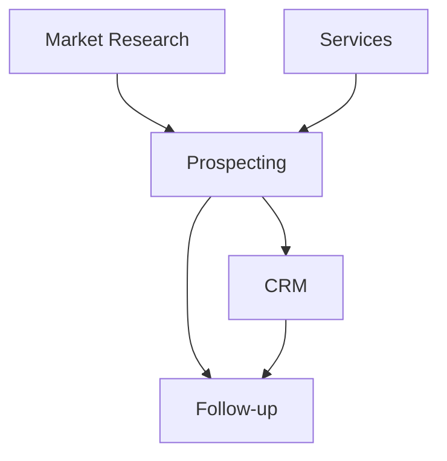

# Estrutura de Módulos - MarketScope AI

Este documento descreve a organização modular do MarketScope AI, detalhando a responsabilidade e estrutura de cada módulo.

## 📁 Visão Geral da Arquitetura

O MarketScope AI está organizado em módulos funcionais independentes, cada um responsável por uma área específica da aplicação:

```
src/modules/
├── crm/                    # Gestão de relacionamento com clientes
├── followup/               # Sistema de follow-up automatizado
├── market-research/        # Pesquisa e análise de mercado
├── prospecting/            # Prospecção e qualificação de leads
└── services/               # Catálogo de serviços e ofertas
```

## 🎯 Módulos Principais

### 1. CRM (Customer Relationship Management)
**Localização**: `src/modules/crm/`

**Responsabilidade**: Gerenciar o relacionamento com clientes, incluindo calendário de atividades, regras de follow-up e exportação de dados.

**Estrutura**:
- `types.ts` - Definições de tipos TypeScript
- `crm-store.ts` - Estado global do módulo CRM (Zustand)
- `calendar-store.ts` - Estado do calendário de atividades
- `crm-export.ts` - Funções de exportação de dados
- `followup-rules.ts` - Lógica de regras de follow-up
- `useFollowupEvaluator.ts` - Hook para avaliar regras de follow-up
- `CRMPage.tsx` - Página principal do CRM
- `CRMCalendar.tsx` - Componente de calendário
- `FollowupRulesPanel.tsx` - Painel de configuração de regras
- `components/` - Componentes específicos do CRM

**Ownership**: 
- Backend/Logic: Kiro
- UI Components: Lovable
- Types: Kiro

---

### 2. Follow-up
**Localização**: `src/modules/followup/`

**Responsabilidade**: Sistema automatizado de follow-up com leads, gerenciando filas e execução de ações programadas.

**Estrutura**:
- `followup-store.ts` - Estado global do módulo de follow-up
- `useFollowupQueueRunner.ts` - Hook para executar fila de follow-ups

**Ownership**: 
- Backend/Logic: Kiro
- UI Components: Lovable

---

### 3. Market Research
**Localização**: `src/modules/market-research/`

**Responsabilidade**: Pesquisa e análise de mercado, tendências e inteligência competitiva.

**Estrutura**:
- `types.ts` - Definições de tipos TypeScript

**Status**: Módulo em desenvolvimento inicial. A maior parte da funcionalidade está em `src/components/market-research/`.

**Ownership**: 
- Backend/Logic: Kiro
- UI Components: Lovable
- Types: Kiro

---

### 4. Prospecting
**Localização**: `src/modules/prospecting/`

**Responsabilidade**: Prospecção de leads, qualificação, análise de oportunidades e geração de pitches personalizados.

**Estrutura**:

#### Core
- `types.ts` - Definições de tipos TypeScript
- `prospecting-store.ts` - Estado global do módulo de prospecção

#### Serviços e Utilitários
- `lead-parser.ts` - Parser de dados de leads
- `local-search-parser.ts` - Parser de resultados de busca local
- `ocr-service.ts` - Serviço de OCR para extração de dados
- `opportunity-score.ts` - Cálculo de score de oportunidade
- `pitch-generator.ts` - Geração automática de pitches
- `social-discovery.ts` - Descoberta de redes sociais
- `sync-service.ts` - Sincronização de dados
- `utils-validation.ts` - Validações e utilitários
- `conversation-roadmap.ts` - Roadmap de conversação com leads

#### Componentes UI
- `ProspectingPage.tsx` - Página principal de prospecção
- `LeadCard.tsx` - Card de visualização de lead
- `LeadPipeline.tsx` - Pipeline de vendas
- `LeadPlaybook.tsx` - Playbook de estratégias
- `DailyAiPlan.tsx` - Plano diário gerado por IA
- `FocusMode.tsx` - Modo foco para trabalho concentrado
- `PerformanceDashboard.tsx` - Dashboard de performance
- `PerformanceReport.tsx` - Relatórios de performance
- `PitchPanel.tsx` - Painel de pitches
- `SitePreview.tsx` - Preview de sites de leads
- `StatusNotesDialog.tsx` - Diálogo de notas e status
- `components/` - Componentes específicos de prospecção

**Ownership**: 
- Backend/Logic: Kiro
- UI Components: Lovable
- Types: Kiro

---

### 5. Services
**Localização**: `src/modules/services/`

**Responsabilidade**: Catálogo de serviços, pacotes, combos e documentação de entrega.

**Estrutura**:
- `services-store.ts` - Estado global do módulo de serviços
- `new-services-data.ts` - Dados de novos serviços
- `AIServicesPage.tsx` - Página de serviços de IA
- `CombosPackagesPage.tsx` - Página de combos e pacotes
- `DeliveryDocumentationPage.tsx` - Documentação de entrega
- `NewServicesPage.tsx` - Página de novos serviços
- `OffersCatalogPage.tsx` - Catálogo de ofertas
- `SingleServicesPage.tsx` - Página de serviços individuais
- `details/` - Detalhes de serviços específicos

**Ownership**: 
- Backend/Logic: Kiro
- UI Components: Lovable

---

## 🔄 Padrões de Organização

### Estrutura Padrão de Módulo

Cada módulo segue uma estrutura consistente:

```
module-name/
├── types.ts              # Tipos TypeScript (Kiro)
├── module-store.ts       # Estado Zustand (Kiro)
├── services/             # Lógica de negócio (Kiro)
├── utils/                # Utilitários (Kiro)
├── hooks/                # React hooks (Compartilhado)
├── components/           # Componentes UI (Lovable)
└── ModulePage.tsx        # Página principal (Lovable)
```

### Convenções de Nomenclatura

- **Stores**: `{module-name}-store.ts`
- **Types**: `types.ts` (um por módulo)
- **Pages**: `{ModuleName}Page.tsx`
- **Components**: PascalCase para componentes React
- **Services**: kebab-case para arquivos de serviço
- **Hooks**: `use{HookName}.ts`

### Ownership por Tipo de Arquivo

| Tipo | Owner | Exemplo |
|------|-------|---------|
| Types | Kiro | `types.ts` |
| Stores | Kiro | `*-store.ts` |
| Services | Kiro | `*-service.ts` |
| Utils | Kiro | `utils-*.ts` |
| Hooks | Compartilhado | `use*.ts` |
| Components | Lovable | `*.tsx` (exceto pages) |
| Pages | Lovable | `*Page.tsx` |

---

## 📊 Estado Atual dos Módulos

| Módulo | Maturidade | Arquivos | Store | Types | Testes |
|--------|-----------|----------|-------|-------|--------|
| CRM | ✅ Maduro | 11 | ✅ | ✅ | ⏳ |
| Follow-up | 🟡 Parcial | 2 | ✅ | ❌ | ❌ |
| Market Research | 🔴 Inicial | 1 | ❌ | ✅ | ❌ |
| Prospecting | ✅ Maduro | 24 | ✅ | ✅ | ⏳ |
| Services | ✅ Maduro | 9 | ✅ | ❌ | ❌ |

**Legenda**:
- ✅ Completo
- 🟡 Parcialmente implementado
- 🔴 Em desenvolvimento inicial
- ⏳ Em progresso
- ❌ Não implementado

---

## 🔗 Dependências Entre Módulos



**Descrição**:
- **Prospecting → CRM**: Leads qualificados são movidos para o CRM
- **Prospecting → Follow-up**: Leads geram ações de follow-up
- **CRM → Follow-up**: Clientes no CRM têm follow-ups programados
- **Market Research → Prospecting**: Insights de mercado informam prospecção
- **Services → Prospecting**: Catálogo de serviços usado em pitches

---

## 🚀 Próximos Passos

### Melhorias Planejadas

1. **Refatoração de Stores** (Fase 4)
   - Separar stores monolíticos em stores modulares
   - Implementar stores para módulos sem store próprio
   - Adicionar testes unitários para stores

2. **Completar Types** (Fase 3)
   - Adicionar `types.ts` para módulos sem tipos
   - Eliminar uso de `any` em todos os módulos
   - Documentar interfaces públicas

3. **Testes** (Fase 5)
   - Adicionar testes unitários para serviços
   - Adicionar testes de integração entre módulos
   - Adicionar testes de componentes

4. **Documentação** (Fase 2)
   - Documentar APIs públicas de cada módulo
   - Criar exemplos de uso
   - Documentar fluxos de dados

---

## 📚 Recursos Adicionais

- [Documentação de Componentes](./components/README.md)
- [Documentação de APIs](./api/README.md)
- [Sistema de Coordenação Kiro-Lovable](../../.kiro/coordination/README.md)
- [Guia de Contribuição](../../CONTRIBUTING.md)

---

**Última atualização**: 2026-05-12
**Mantido por**: Kiro (infraestrutura) e Lovable (UI)
