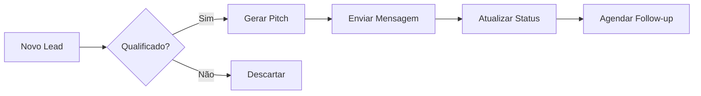
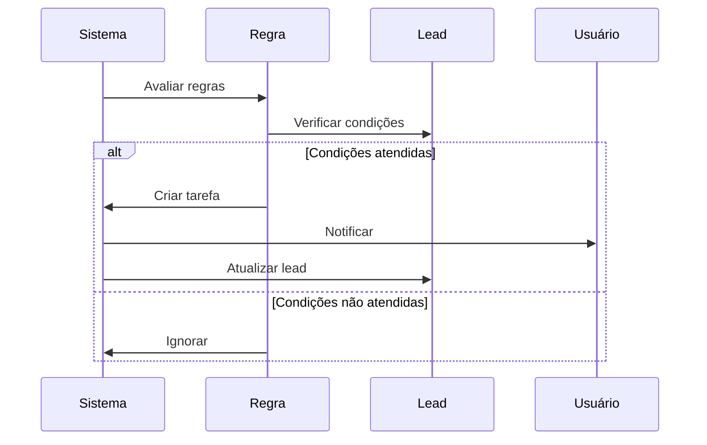
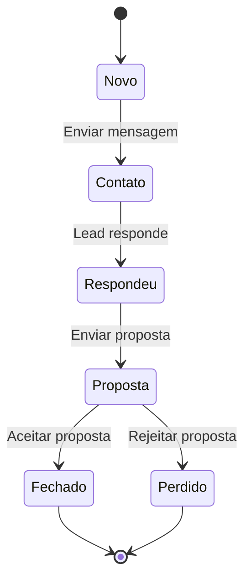

# Módulo CRM (Customer Relationship Management)

## 📋 Visão Geral

O módulo CRM gerencia o relacionamento com clientes, incluindo calendário de atividades, regras de follow-up automatizado, exportação de dados e análise de pipeline de vendas.

**Localização**: `src/modules/crm/`  
**Ownership**: Kiro (backend/lógica) | Lovable (UI)  
**Status**: ✅ Maduro (11 arquivos)

---

## 🎯 Responsabilidades

1. **Pipeline de Vendas**: Gestão de estágios de conversão
2. **Calendário de Atividades**: Agendamento e rastreamento de ações
3. **Regras de Follow-up**: Automação de follow-ups baseada em regras
4. **Exportação de Dados**: Exportação para WhatsApp, CSV, Make.com
5. **Métricas e Dashboards**: Análise de performance e conversão
6. **Gestão de Tarefas**: Criação e acompanhamento de tarefas
7. **Histórico de Atividades**: Registro completo de interações

---

## 📁 Estrutura de Arquivos

```
crm/
├── types.ts                      # 📘 Definições de tipos TypeScript
├── crm-store.ts                  # 🗄️ Estado global do CRM (Zustand)
├── calendar-store.ts             # 📅 Estado do calendário
├── crm-export.ts                 # 📤 Funções de exportação
├── followup-rules.ts             # 📋 Lógica de regras de follow-up
├── useFollowupEvaluator.ts       # 🔍 Hook para avaliar regras
├── CRMPage.tsx                   # 📄 Página principal (Lovable)
├── CRMCalendar.tsx               # 📅 Componente de calendário (Lovable)
├── FollowupRulesPanel.tsx        # ⚙️ Painel de configuração (Lovable)
└── components/                   # 🎨 Componentes específicos
```

---

## 🔑 Tipos Principais

### PipelineStage
Estágios do pipeline de vendas.

```typescript
type PipelineStage = 
  | 'novo'        // Lead recém-criado
  | 'contato'     // Primeiro contato realizado
  | 'respondeu'   // Lead respondeu
  | 'proposta'    // Proposta enviada
  | 'fechado';    // Negócio fechado
```

### LeadUpdate
Payload para atualização de leads.

```typescript
interface LeadUpdate {
  // Status
  status?: LeadStatus;
  contactStatus?: ContactStatus;
  pipelineStage?: PipelineStage;
  
  // Dados básicos
  companyName?: string;
  email?: string;
  whatsapp?: string;
  instagramHandle?: string;
  websiteUrl?: string;
  
  // Qualificação
  opportunityScore?: number;
  opportunityLevel?: 'baixa' | 'média' | 'boa' | 'quente';
  leadScore?: number;
  closingChance?: number;
  
  // Receita
  estimatedValue?: number;
  expectedRevenue?: number;
  negotiatedPrice?: number;
  
  // Timestamps
  lastContactAt?: string;
  nextFollowUpAt?: string;
  lastInteractionAt?: string;
  nextActionAt?: string;
  
  // Flags
  whatsappSent?: boolean;
  coolingFlag?: boolean;
  blockContact?: boolean;
  
  // Automação
  automationMode?: 'manual' | 'assisted' | 'automatic';
  
  // Campos customizados
  [key: string]: unknown;
}
```

### CRMActivity
Registro de atividade no CRM.

```typescript
type ActivityType =
  | 'call'
  | 'email'
  | 'whatsapp'
  | 'instagram'
  | 'meeting'
  | 'note'
  | 'task'
  | 'status_change';

interface CRMActivity {
  id: string;
  leadId: string;
  type: ActivityType;
  title: string;
  description?: string;
  timestamp: string;
  userId?: string;
  userName?: string;
  metadata?: Record<string, unknown>;
  outcome?: 'positive' | 'neutral' | 'negative';
  nextAction?: {
    type: ActivityType;
    dueDate: string;
    description: string;
  };
}
```

### CRMTask
Tarefa do CRM.

```typescript
type TaskPriority = 'low' | 'medium' | 'high' | 'urgent';
type TaskStatus = 'pending' | 'in_progress' | 'completed' | 'cancelled';

interface CRMTask {
  id: string;
  leadId?: string;
  title: string;
  description?: string;
  type: ActivityType;
  priority: TaskPriority;
  status: TaskStatus;
  dueDate: string;
  assignedTo?: string;
  createdBy?: string;
  createdAt: string;
  updatedAt: string;
  completedAt?: string;
  metadata?: Record<string, unknown>;
}
```

---

## 🔄 Pipeline de Vendas

### Configuração de Estágios

```typescript
interface PipelineStageConfig {
  stage: PipelineStage;
  name: string;
  description?: string;
  color: string;
  order: number;
  slaHours?: number;              // SLA em horas
  requiredActions?: string[];     // Ações obrigatórias
  nextStages?: PipelineStage[];   // Próximos estágios possíveis
}
```

**Estágios Padrão**:

| Estágio | Nome | SLA | Cor | Ações Obrigatórias |
|---------|------|-----|-----|-------------------|
| `novo` | Novo Lead | 24h | Azul | Qualificar, Pesquisar |
| `contato` | Primeiro Contato | 72h | Amarelo | Enviar mensagem |
| `respondeu` | Lead Respondeu | 48h | Verde | Agendar reunião |
| `proposta` | Proposta Enviada | 120h | Laranja | Follow-up |
| `fechado` | Negócio Fechado | - | Verde Escuro | Onboarding |

### Estatísticas do Pipeline

```typescript
interface PipelineStatistics {
  byStage: Record<PipelineStage, {
    count: number;
    value: number;
    conversionRate?: number;
    avgTimeInStage?: number;
  }>;
  totalLeads: number;
  totalValue: number;
  conversionRate: number;
  avgDealSize: number;
  winRate: number;
}
```

**Exemplo de Cálculo**:
```typescript
// Conversion Rate = (Leads Fechados / Total Leads) × 100
conversionRate = (closedLeads / totalLeads) * 100;

// Win Rate = (Leads Fechados / (Leads Fechados + Leads Perdidos)) × 100
winRate = (closedLeads / (closedLeads + lostLeads)) * 100;

// Average Deal Size = Total Value / Closed Leads
avgDealSize = totalValue / closedLeads;
```

---

## 📅 Calendário de Atividades

### Eventos do Calendário

```typescript
interface CalendarEvent {
  id: string;
  leadId: string;
  leadName: string;
  type: ActivityType;
  title: string;
  description?: string;
  startDate: string;
  endDate?: string;
  allDay?: boolean;
  status: 'scheduled' | 'completed' | 'cancelled';
  reminder?: {
    enabled: boolean;
    minutesBefore: number;
  };
  metadata?: Record<string, unknown>;
}
```

### Visualizações Suportadas
- **Dia**: Visualização diária com horários
- **Semana**: Visualização semanal
- **Mês**: Visualização mensal
- **Agenda**: Lista de eventos

---

## 🔔 Regras de Follow-up

### Estrutura de Regra

```typescript
interface FollowupRule {
  id: string;
  name: string;
  description?: string;
  enabled: boolean;
  priority: number;
  
  // Condições
  conditions: {
    pipelineStage?: PipelineStage[];
    status?: LeadStatus[];
    daysSinceLastContact?: number;
    opportunityLevel?: OpportunityLevel[];
    customConditions?: Array<{
      field: string;
      operator: 'equals' | 'not_equals' | 'greater_than' | 'less_than' | 'contains';
      value: unknown;
    }>;
  };
  
  // Ações
  actions: {
    createTask?: {
      type: ActivityType;
      title: string;
      description?: string;
      priority: TaskPriority;
      dueInDays: number;
    };
    sendNotification?: {
      title: string;
      message: string;
      priority: 'low' | 'medium' | 'high';
    };
    updateLead?: LeadUpdate;
    triggerAutomation?: {
      type: string;
      payload: Record<string, unknown>;
    };
  };
  
  // Metadados
  createdAt: string;
  updatedAt: string;
  lastTriggeredAt?: string;
  triggerCount: number;
}
```

### Exemplos de Regras

#### 1. Follow-up Automático após 3 dias

```typescript
{
  name: "Follow-up 3 dias sem resposta",
  conditions: {
    pipelineStage: ['contato'],
    daysSinceLastContact: 3
  },
  actions: {
    createTask: {
      type: 'whatsapp',
      title: 'Follow-up WhatsApp',
      description: 'Lead não respondeu há 3 dias',
      priority: 'high',
      dueInDays: 0
    },
    updateLead: {
      coolingFlag: true
    }
  }
}
```

#### 2. Alerta de Lead Esfriando

```typescript
{
  name: "Alerta: Lead esfriando",
  conditions: {
    pipelineStage: ['respondeu', 'proposta'],
    daysSinceLastContact: 5
  },
  actions: {
    sendNotification: {
      title: 'Lead Esfriando',
      message: 'Lead sem interação há 5 dias',
      priority: 'high'
    },
    updateLead: {
      coolingFlag: true,
      nextActionAt: new Date(Date.now() + 24 * 60 * 60 * 1000).toISOString()
    }
  }
}
```

#### 3. Proposta Vencida

```typescript
{
  name: "Proposta vencida - reativar",
  conditions: {
    pipelineStage: ['proposta'],
    daysSinceLastContact: 7
  },
  actions: {
    createTask: {
      type: 'call',
      title: 'Ligar para reativar proposta',
      description: 'Proposta enviada há 7 dias sem resposta',
      priority: 'urgent',
      dueInDays: 0
    },
    updateLead: {
      status: 'Follow-Up',
      nextActionAt: new Date().toISOString()
    }
  }
}
```

---

## 📊 Métricas e Dashboards

### Dashboard Metrics

```typescript
interface DashboardMetrics {
  // Contadores
  totalLeads: number;
  newLeads: number;              // Últimos 7 dias
  activeLeads: number;
  contactedLeads: number;
  respondedLeads: number;
  closedLeads: number;
  
  // Valores
  pipelineValue: number;
  expectedRevenue: number;
  
  // Taxas
  conversionRate: number;        // %
  winRate: number;               // %
  
  // Tempos
  avgResponseTime?: number;      // Horas
  avgDealCycle?: number;         // Dias
}
```

### Gráficos Disponíveis

```typescript
interface DashboardChartData {
  type: 'line' | 'bar' | 'pie' | 'funnel';
  title: string;
  data: Array<{
    label: string;
    value: number;
    color?: string;
  }>;
  metadata?: Record<string, unknown>;
}
```

**Gráficos Padrão**:
1. **Funil de Conversão**: Pipeline stages
2. **Receita Mensal**: Linha temporal
3. **Leads por Fonte**: Pizza
4. **Taxa de Conversão**: Barra
5. **Tempo no Estágio**: Barra horizontal

---

## 📤 Exportação de Dados

### Formatos Suportados

```typescript
type ExportFormat = 'csv' | 'xlsx' | 'json' | 'pdf';

interface ExportOptions {
  format: ExportFormat;
  fields?: string[];
  filter?: LeadFilterCriteria;
  includeActivities?: boolean;
  includeNotes?: boolean;
  includeContactHistory?: boolean;
}
```

### Exportação para WhatsApp

```typescript
interface WhatsAppExportOptions {
  leads: ProspectLead[];
  messageTemplate?: string;
  includeCompanyName?: boolean;
  includeNiche?: boolean;
  includeCity?: boolean;
  customFields?: string[];
}

// Resultado
interface WhatsAppExportResult {
  success: boolean;
  contacts: Array<{
    name: string;
    phone: string;
    message?: string;
  }>;
  totalContacts: number;
  exportedAt: string;
}
```

### Exportação para Make.com

```typescript
interface MakeWebhookPayload {
  leads: ProspectLead[];
  metadata: {
    exportedAt: string;
    exportedBy: string;
    totalLeads: number;
    filters?: LeadFilterCriteria;
  };
}
```

---

## 🔍 Filtros e Busca

### Critérios de Filtro

```typescript
interface LeadFilterCriteria {
  // Status
  status?: LeadStatus[];
  contactStatus?: ContactStatus[];
  pipelineStage?: PipelineStage[];
  
  // Segmentação
  niche?: string[];
  city?: string[];
  source?: string[];
  opportunityLevel?: OpportunityLevel[];
  
  // Ranges
  scoreRange?: { min: number; max: number };
  valueRange?: { min: number; max: number };
  
  // Datas
  dateRange?: {
    field: 'createdAt' | 'lastContactAt' | 'nextFollowUpAt' | 'lastInteractionAt';
    from: string;
    to: string;
  };
  
  // Outros
  tags?: string[];
  assignedTo?: string[];
  search?: string;
}
```

### Opções de Ordenação

```typescript
interface LeadSortOptions {
  field:
    | 'companyName'
    | 'createdAt'
    | 'updatedAt'
    | 'lastContactAt'
    | 'nextFollowUpAt'
    | 'opportunityScore'
    | 'leadScore'
    | 'estimatedValue';
  direction: 'asc' | 'desc';
}
```

---

## 🔔 Notificações

### Tipos de Notificação

```typescript
type NotificationType =
  | 'followup_due'        // Follow-up vencido
  | 'lead_cooling'        // Lead esfriando
  | 'response_received'   // Resposta recebida
  | 'task_due'            // Tarefa vencida
  | 'milestone_reached'   // Marco alcançado
  | 'alert';              // Alerta geral

interface CRMNotification {
  id: string;
  type: NotificationType;
  title: string;
  message: string;
  leadId?: string;
  taskId?: string;
  priority: 'low' | 'medium' | 'high';
  read: boolean;
  createdAt: string;
  actionUrl?: string;
  metadata?: Record<string, unknown>;
}
```

---

## 🔄 Fluxos de Trabalho

### 1. Novo Lead → Primeiro Contato



### 2. Follow-up Automático



### 3. Conversão de Lead



---

## 📚 Exemplos de Uso

### Atualizar Lead no Pipeline

```typescript
import { useCRMStore } from '@/modules/crm/crm-store';

const store = useCRMStore();

await store.updateLead(leadId, {
  pipelineStage: 'respondeu',
  lastInteractionAt: new Date().toISOString(),
  nextActionAt: new Date(Date.now() + 48 * 60 * 60 * 1000).toISOString(),
});
```

### Criar Tarefa

```typescript
const task: CRMTask = {
  id: generateId(),
  leadId: lead.id,
  title: 'Follow-up WhatsApp',
  description: 'Enviar mensagem de follow-up',
  type: 'whatsapp',
  priority: 'high',
  status: 'pending',
  dueDate: new Date(Date.now() + 24 * 60 * 60 * 1000).toISOString(),
  createdAt: new Date().toISOString(),
  updatedAt: new Date().toISOString(),
};

await store.createTask(task);
```

### Exportar para WhatsApp

```typescript
import { exportToWhatsApp } from '@/modules/crm/crm-export';

const result = await exportToWhatsApp({
  leads: selectedLeads,
  messageTemplate: 'Olá {companyName}, tudo bem?',
  includeCompanyName: true,
  includeNiche: true,
});

console.log(`${result.totalContacts} contatos exportados`);
```

### Avaliar Regras de Follow-up

```typescript
import { useFollowupEvaluator } from '@/modules/crm/useFollowupEvaluator';

const { evaluateRules } = useFollowupEvaluator();

const triggeredRules = await evaluateRules(lead);

triggeredRules.forEach(rule => {
  console.log(`Regra ativada: ${rule.name}`);
  // Executar ações da regra
});
```

---

## 🧪 Testes

### Testes Unitários (Planejado)
- [ ] `crm-export.test.ts`
- [ ] `followup-rules.test.ts`
- [ ] `useFollowupEvaluator.test.ts`

### Testes de Integração (Planejado)
- [ ] Fluxo completo de pipeline
- [ ] Regras de follow-up automático
- [ ] Exportação de dados

---

## 🚀 Próximos Passos

### Melhorias Planejadas

1. **Refatoração de Store** (Fase 4)
   - Separar `crm-store.ts` em stores modulares
   - Implementar store de pipeline separado
   - Adicionar testes unitários

2. **Automação Avançada**
   - Integração com WhatsApp Business API
   - Envio automático de mensagens
   - Respostas automáticas baseadas em IA

3. **Analytics**
   - Dashboard avançado com mais métricas
   - Previsão de receita com ML
   - Análise de churn

4. **Integrações**
   - Zapier
   - HubSpot
   - Salesforce

---

## 📖 Recursos Relacionados

- [Tipos TypeScript](../../src/modules/crm/types.ts)
- [Store Zustand](../../src/modules/crm/crm-store.ts)
- [Documentação de Prospecting](./prospecting.md)
- [Documentação de Follow-up](./followup.md)

---

**Última atualização**: 2026-05-12  
**Mantido por**: Kiro (infraestrutura) e Lovable (UI)
