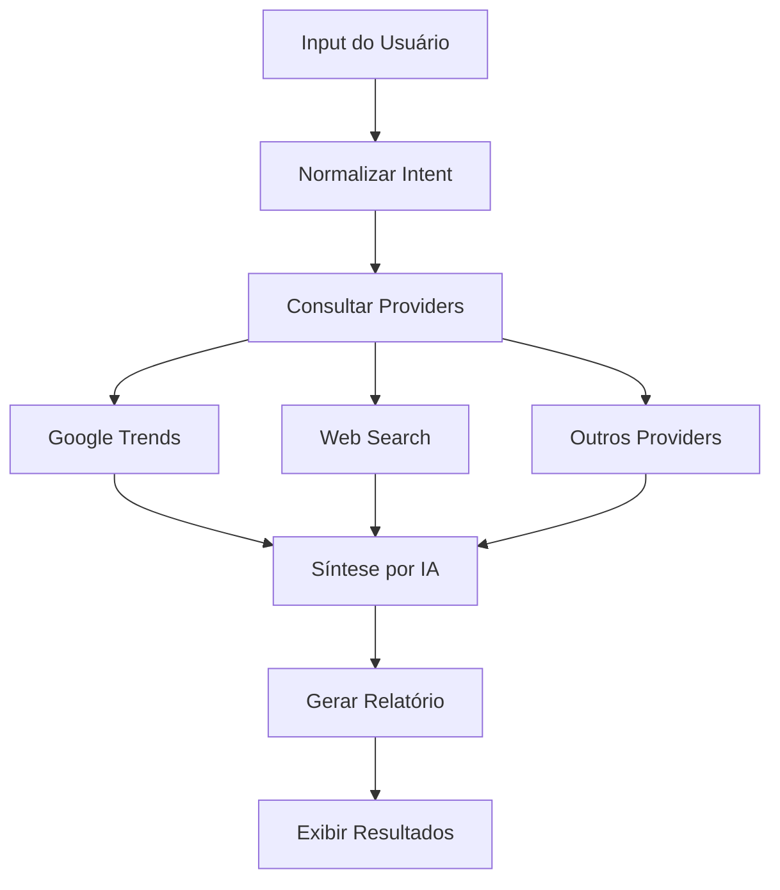

# Módulo Market Research

## 📋 Visão Geral

O módulo Market Research fornece análise de mercado, tendências e inteligência competitiva através de múltiplas fontes de dados e síntese por IA.

**Localização**: `src/modules/market-research/`  
**Ownership**: Kiro (backend/lógica) | Lovable (UI)  
**Status**: 🔴 Inicial (1 arquivo)

---

## 🎯 Responsabilidades

1. **Pesquisa de Mercado**: Análise de tendências e oportunidades
2. **Inteligência Competitiva**: Identificação de concorrentes
3. **Análise de Audiência**: Perfil de público-alvo
4. **Síntese por IA**: Consolidação de dados de múltiplas fontes
5. **Relatórios**: Geração de relatórios estruturados

---

## 📁 Estrutura de Arquivos

```
market-research/
├── types.ts                      # 📘 Definições de tipos TypeScript
└── (componentes em src/components/market-research/)
```

**Nota**: A maior parte da funcionalidade está em `src/components/market-research/` e `src/server/market-research/`.

---

## 🔑 Tipos Principais

### MarketResearchReport

```typescript
interface MarketResearchReport {
  id: string;
  input: string;
  synthesis: string;
  insights: {
    competitors: Array<{
      name: string;
      description?: string;
      url?: string;
    }>;
    opportunities: string[];
    risks: string[];
    marketHypothesis: string[];
    audienceQuestions: Array<{
      question: string;
      source?: string;
    }>;
  };
  trendSignal: MarketResearchTrendSignal;
  confidence: MarketResearchConfidenceLevel;
  sources: MarketResearchSource[];
  charts: Array<{
    title: string;
    type: 'line' | 'bar';
    data: Array<{ label: string; value: number }>;
  }>;
  createdAt: string;
  metadata?: Record<string, unknown>;
}
```

### ResearchContext

```typescript
interface ResearchContext {
  input: string;
  normalizedIntent?: NormalizedIntent;
  preferences?: {
    depth?: 'quick' | 'standard' | 'deep';
    focusAreas?: string[];
    excludeTopics?: string[];
  };
  geographic?: {
    country?: string;
    region?: string;
    city?: string;
  };
  industry?: {
    primary?: string;
    related?: string[];
    keywords?: string[];
  };
  temporal?: {
    period?: string;
    compareWith?: string;
  };
}
```

### GoogleTrendsData

```typescript
interface GoogleTrendsData {
  query: string;
  geo?: string;
  timeRange?: string;
  interestOverTime?: Array<{
    time: string;
    value: number;
  }>;
  interestByRegion?: Array<{
    region: string;
    value: number;
  }>;
  relatedQueries?: {
    top?: Array<{ query: string; value: number }>;
    rising?: Array<{ query: string; value: number }>;
  };
  averageInterest?: number;
  trend?: 'rising' | 'stable' | 'declining';
}
```

---

## 🔄 Fluxo de Pesquisa



---

## 🔌 Research Providers

### Interface Base

```typescript
interface ResearchProvider {
  name: string;
  status: 'configured' | 'unavailable' | 'failed' | 'skipped';
  fetch(input: string, context?: ResearchContext): Promise<ResearchProviderResult>;
}
```

### Providers Disponíveis

1. **Google Trends**: Tendências de busca
2. **Web Search**: Busca na web
3. **Lovable AI**: Síntese por IA
4. **Custom Providers**: Extensível

---

## 📊 Análise de Mercado

### Market Size Estimate

```typescript
interface MarketSizeEstimate {
  value: number;
  currency: string;
  period: string;
  geography: string;
  confidence: 'high' | 'medium' | 'low';
  source?: string;
  growthRate?: number;
}
```

### Competitive Landscape

```typescript
interface CompetitiveLandscape {
  competitorCount: number;
  concentration: 'fragmented' | 'moderate' | 'concentrated';
  topCompetitors: Array<{
    name: string;
    marketShare?: number;
    description?: string;
    strengths?: string[];
    weaknesses?: string[];
  }>;
  barriersToEntry: Array<{
    type: string;
    severity: 'low' | 'medium' | 'high';
    description: string;
  }>;
}
```

### Target Audience Profile

```typescript
interface TargetAudienceProfile {
  segment: string;
  demographics?: {
    ageRange?: string;
    gender?: string;
    income?: string;
    education?: string;
    location?: string;
  };
  psychographics?: {
    interests?: string[];
    values?: string[];
    lifestyle?: string;
    painPoints?: string[];
  };
  behavioral?: {
    purchaseBehavior?: string;
    mediaConsumption?: string[];
    brandPreferences?: string[];
  };
  size?: {
    value: number;
    unit: 'people' | 'households' | 'businesses';
  };
}
```

---

## 📚 Exemplos de Uso

### Realizar Pesquisa de Mercado

```typescript
import { performMarketResearch } from '@/server/market-research.functions';

const report = await performMarketResearch({
  input: 'Mercado de energia solar residencial no Brasil',
  context: {
    geographic: {
      country: 'Brasil',
      region: 'Sudeste',
    },
    industry: {
      primary: 'Energia Solar',
      keywords: ['fotovoltaica', 'residencial', 'sustentabilidade'],
    },
    preferences: {
      depth: 'deep',
      focusAreas: ['tamanho de mercado', 'concorrentes', 'tendências'],
    },
  },
});

console.log(report.synthesis);
console.log(report.insights.competitors);
```

### Analisar Tendências

```typescript
import { fetchGoogleTrends } from '@/server/market-research/providers/googleTrends.provider';

const trends = await fetchGoogleTrends('energia solar', {
  geo: 'BR',
  timeRange: 'today 12-m',
});

console.log(`Tendência: ${trends.trend}`);
console.log(`Interesse médio: ${trends.averageInterest}`);
```

---

## 🚀 Próximos Passos

### Melhorias Planejadas

1. **Estrutura de Módulo** (Fase 4)
   - Criar `market-research-store.ts`
   - Mover componentes para `src/modules/market-research/components/`
   - Adicionar serviços em `src/modules/market-research/services/`

2. **Providers Adicionais**
   - LinkedIn Insights
   - Statista API
   - IBGE API (dados brasileiros)
   - Similarweb API

3. **Features**
   - Comparação de mercados
   - Análise de sazonalidade
   - Previsão de tendências com ML
   - Alertas de mudanças de mercado

4. **Testes** (Fase 5)
   - Testes unitários para providers
   - Testes de integração
   - Mocks de APIs externas

---

## 📖 Recursos Relacionados

- [Tipos TypeScript](../../src/modules/market-research/types.ts)
- [Componentes UI](../../src/components/market-research/)
- [Server Functions](../../src/server/market-research/)
- [Documentação de Prospecting](./prospecting.md)

---

**Última atualização**: 2026-05-12  
**Mantido por**: Kiro (infraestrutura) e Lovable (UI)
