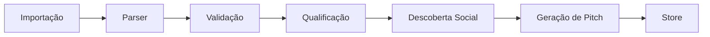
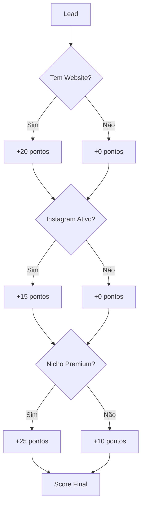
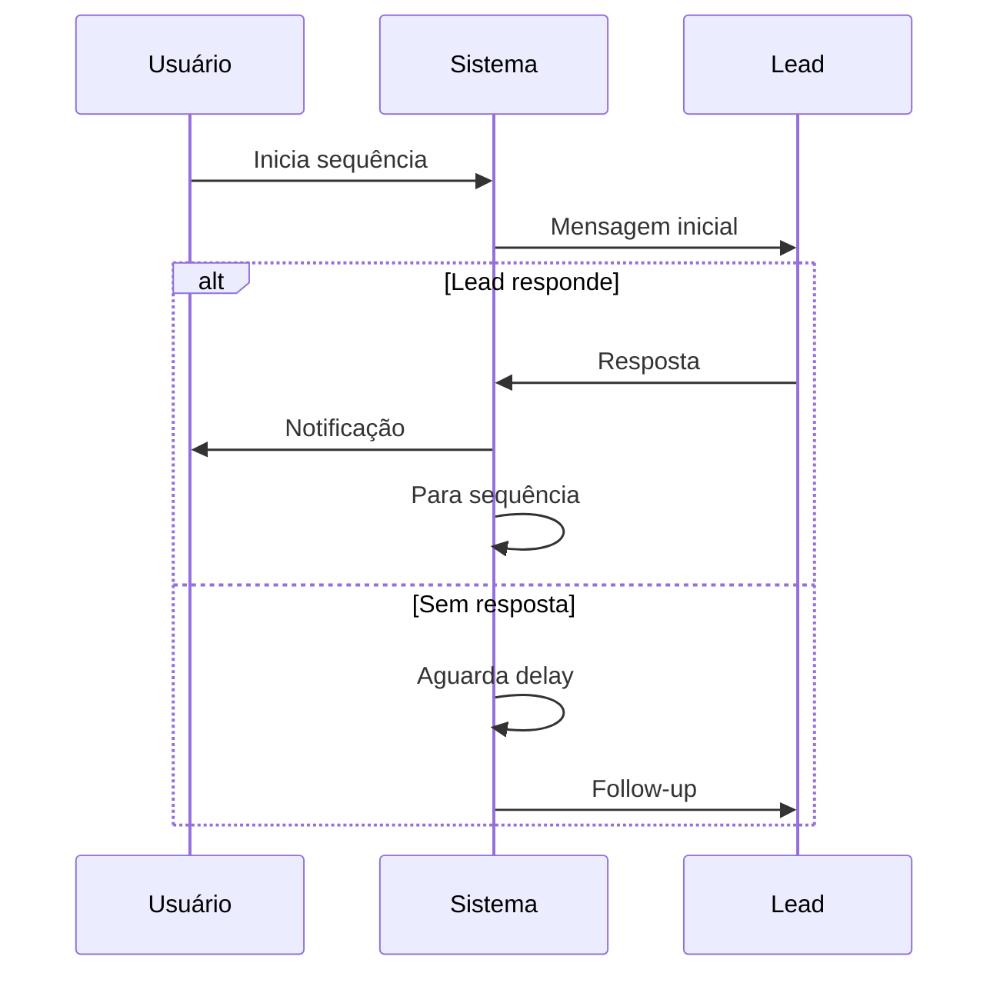

# Módulo de Prospecção (Prospecting)

## 📋 Visão Geral

O módulo de Prospecção é o coração do MarketScope AI, responsável por todo o ciclo de vida de leads desde a descoberta até a qualificação e preparação para conversão.

**Localização**: `src/modules/prospecting/`  
**Ownership**: Kiro (backend/lógica) | Lovable (UI)  
**Status**: ✅ Maduro (24 arquivos)

---

## 🎯 Responsabilidades

1. **Gestão de Leads**: CRUD completo de leads com validação
2. **Qualificação Automática**: Score de oportunidade e análise de viabilidade
3. **Descoberta Social**: Busca automática de redes sociais
4. **Geração de Pitches**: Criação automática de mensagens personalizadas
5. **Análise Psicológica**: Perfil comportamental e estratégia de abordagem
6. **Planejamento Diário**: Plano de ação gerado por IA
7. **Performance Tracking**: Métricas e relatórios de desempenho

---

## 📁 Estrutura de Arquivos

### Core (Kiro)
```
prospecting/
├── types.ts                      # 📘 Definições de tipos (3,680 linhas)
├── prospecting-store.ts          # 🗄️ Estado global Zustand
└── components/                   # 🎨 Componentes específicos
```

### Serviços e Utilitários (Kiro)
```
├── lead-parser.ts                # Parser de dados de leads
├── local-search-parser.ts        # Parser de resultados Google Places
├── ocr-service.ts                # Extração de dados via OCR
├── opportunity-score.ts          # Cálculo de score de oportunidade
├── pitch-generator.ts            # Geração automática de pitches
├── social-discovery.ts           # Descoberta de redes sociais
├── sync-service.ts               # Sincronização de dados
├── utils-validation.ts           # Validações e utilitários
└── conversation-roadmap.ts       # Roadmap de conversação
```

### Componentes UI (Lovable)
```
├── ProspectingPage.tsx           # Página principal
├── LeadCard.tsx                  # Card de visualização de lead
├── LeadPipeline.tsx              # Pipeline de vendas
├── LeadPlaybook.tsx              # Playbook de estratégias
├── DailyAiPlan.tsx               # Plano diário gerado por IA
├── FocusMode.tsx                 # Modo foco
├── PerformanceDashboard.tsx      # Dashboard de performance
├── PerformanceReport.tsx         # Relatórios
├── PitchPanel.tsx                # Painel de pitches
├── SitePreview.tsx               # Preview de sites
└── StatusNotesDialog.tsx         # Diálogo de notas
```

---

## 🔑 Tipos Principais

### ProspectLead
Interface principal que representa um lead no sistema.

```typescript
interface ProspectLead {
  // Identificação
  id: string;
  companyName: string;
  
  // Contato
  email?: string;
  whatsapp?: string;
  instagramHandle?: string;
  instagramUrl?: string;
  websiteUrl?: string;
  linkedinUrl?: string;
  
  // Localização
  niche: string;
  city: string;
  neighborhood?: string;
  address?: string;
  
  // Qualificação
  opportunityScore: number;          // 0-100
  opportunityLevel: OpportunityLevel; // 'baixa' | 'média' | 'boa' | 'quente'
  diagnosis: string;
  
  // Status
  status: LeadStatus;
  contactStatus?: ContactStatus;
  pipelineStage?: PipelineStage;
  
  // Análise
  socialDiscovery?: SocialDiscoveryData;
  generatedPitch?: GeneratedPitch;
  psychologicalAnalysis?: PsychologicalAnalysis;
  emotionalAnalysis?: EmotionalAnalysis;
  
  // Receita
  closingChance?: number;
  estimatedValue?: number;
  expectedRevenue?: number;
  revenueInsight?: LeadRevenueInsight;
  
  // Automação
  automationMode?: AutomationMode;
  sequence?: FollowUpSequence;
  autonomousDecision?: AutonomousDecision;
  
  // Timestamps
  createdAt: string;
  updatedAt: string;
  lastContactAt?: string;
  nextFollowUpAt?: string;
}
```

### LeadStatus
Estados possíveis de um lead no sistema.

```typescript
type LeadStatus = 
  | 'Novo'
  | 'Lead Gerado'
  | 'Qualificado'
  | 'Contatado'
  | 'Cold Mail Enviado'
  | 'LinkedIn Enviado'
  | 'WhatsApp Enviado'
  | 'Instagram Enviado'
  | 'Follow-Up'
  | 'Interessado'
  | 'Em Diagnóstico'
  | 'Proposta Enviada'
  | 'Agendado'
  | 'Lead Fechado'
  | 'Perdido';
```

### OpportunityLevel
Níveis de oportunidade baseados em score.

```typescript
type OpportunityLevel = 'baixa' | 'média' | 'boa' | 'quente';
```

---

## 🧠 Funcionalidades Principais

### 1. Descoberta Social (social-discovery.ts)

Busca automática de redes sociais do lead.

```typescript
interface SocialDiscoveryData {
  instagramUrl?: string;
  instagramHandle?: string;
  facebookUrl?: string;
  tiktokUrl?: string;
  linkedinUrl?: string;
  youtubeUrl?: string;
  
  recentPosts?: Array<{
    caption: string;
    date: string;
    imageUrl?: string;
  }>;
  
  suggestedHook?: string;
  suggestedHeadline?: string;
  
  status: SocialDiscoveryStatus;
  confidence: number;
  evidence: string;
  lastCheckedAt?: string;
}
```

**Status possíveis**:
- `pendente`: Ainda não foi feita a busca
- `encontrado`: Redes sociais encontradas com alta confiança
- `parcial`: Algumas redes encontradas
- `não_encontrado`: Nenhuma rede encontrada
- `revisar_manual`: Requer revisão manual

---

### 2. Geração de Pitches (pitch-generator.ts)

Gera mensagens personalizadas para cada canal.

```typescript
interface GeneratedPitch {
  whatsappShort: string;
  whatsappConsultative: string;
  instagramDirect: string;
  linkedinOutreach: string;
  coldMail1: string;
  whatsapp1: string;
  followup24h: string;
  followup72h: string;
  
  playbook?: {
    approachStrategy: string;
    contentSuggestions: string[];
    objectionHandling: Array<{
      trigger: string;
      response: string;
    }>;
  };
}
```

**Canais suportados**:
- WhatsApp (curto e consultivo)
- Instagram Direct
- LinkedIn Outreach
- Cold Email
- Follow-ups (24h e 72h)

---

### 3. Análise Psicológica (psychological-analysis)

Identifica o perfil comportamental do lead.

```typescript
type LeadPsychologicalProfile = 
  | 'Analítico'
  | 'Direto'
  | 'Desconfiado'
  | 'Ocupado'
  | 'Curioso'
  | 'Indeciso'
  | 'Reativo'
  | 'Híbrido';

interface PsychologicalAnalysis {
  profile: LeadPsychologicalProfile;
  confidence: number;
  reasoning: string;
  recommendedTone: string;
  avoidTraits: string[];
  hybridWith?: LeadPsychologicalProfile;
  activeCTA?: string;
  behaviorAdjustment?: string;
}
```

**Perfis e Estratégias**:
- **Analítico**: Dados, números, ROI
- **Direto**: Objetivo, sem rodeios
- **Desconfiado**: Provas sociais, garantias
- **Ocupado**: Rápido, valor imediato
- **Curioso**: Storytelling, novidades
- **Indeciso**: Comparações, guia de decisão
- **Reativo**: Urgência, escassez

---

### 4. Análise Emocional (emotional-analysis)

Detecta o estado emocional atual do lead.

```typescript
type LeadEmotion = 
  | 'Interesse'
  | 'Curiosidade'
  | 'Dúvida'
  | 'Desconfiança'
  | 'Pressa'
  | 'Irritação'
  | 'Indiferença'
  | 'Abertura'
  | 'Resistência'
  | 'Urgência'
  | 'Comparação de Preço'
  | 'Medo de Investir'
  | 'Neutro';

interface EmotionalAnalysis {
  probableEmotion: LeadEmotion;
  confidence: 'Alta' | 'Média' | 'Baixa';
  riskOfResponse: 'Baixo' | 'Médio' | 'Alto';
  recommendedTone: string;
  alerts: string[];
  moment: 'avançar' | 'explicar' | 'pausar' | 'fechar' | 'encerrar';
  trend: 'aquecendo' | 'esfriando' | 'estável' | 'risco_perda';
  idealResponse?: string;
  emotionalStaircasePhase?: string;
  nextObjective?: string;
}
```

**Escada Emocional**:
1. **Curiosidade**: Despertar interesse
2. **Interesse**: Apresentar valor
3. **Confiança**: Construir credibilidade
4. **Urgência**: Criar senso de oportunidade
5. **Fechamento**: Converter

---

### 5. Insight de Receita (revenue-insight)

Análise de precificação e probabilidade de fechamento.

```typescript
interface LeadRevenueInsight {
  serviceId: string;
  suggestedPrice: number;
  optimalProfitPrice: number;
  minimumSecurePrice: number;
  breakEvenPoint: number;
  
  priceSensitivity: 'sensível a preço' | 'neutro' | 'orientado a valor';
  negotiationStrategy: string;
  
  closingProbability: number; // 0-100
  expectedValue: number;
  reasoning: string;
  
  marginProtectionAlert?: string;
  profitOpportunityAlert?: string;
  
  discountImpact?: {
    suggestedPrice: number;
    probabilityIncrease: number;
    revenueImpact: number;
    marginImpact: number;
  };
}
```

**Métricas de Receita**:
- **Preço Sugerido**: Baseado em análise de mercado
- **Preço Ótimo**: Maximiza lucro
- **Preço Mínimo**: Protege margem
- **Ponto de Equilíbrio**: Cobre custos
- **Probabilidade de Fechamento**: 0-100%
- **Valor Esperado**: Probabilidade × Valor

---

### 6. Plano Diário (daily-plan)

Plano de ação gerado por IA.

```typescript
interface DailyPlan {
  date: string;
  tasks: DailyTask[];
  status: 'on_track' | 'delayed' | 'at_risk' | 'ahead' | 'completed' | 'emergency';
  
  summary: {
    newContacts: number;
    followUps: number;
    hotLeads: number;
    estimatedTotalTime: number;
    revenueGap: number;
    chanceOfHittingGoal: 'Alta' | 'Média' | 'Baixa';
    projectedRevenue: number;
    deviationPercentage: number;
  };
  
  recoveryPlan?: {
    dailyContactsTarget: number;
    dailyFollowUpsTarget: number;
    requiredClosures: number;
    recommendedActions: string[];
  };
  
  recommendations: string[];
  adjustment?: OperationalAdjustment;
}
```

**Tipos de Tarefas**:
- `closure`: Fechar negócio quente
- `followup`: Follow-up agendado
- `new_contact`: Novo contato
- `revision`: Revisar estratégia

---

### 7. Sequência de Follow-up (followup-sequence)

Automação de follow-ups multi-canal.

```typescript
interface FollowUpSequence {
  currentStep: number;
  totalSteps: number;
  steps: FollowUpStep[];
  isActive: boolean;
  stopReason?: 'responded' | 'limit_reached' | 'manual' | 'error';
}

interface FollowUpStep {
  channel: 'WhatsApp' | 'Instagram' | 'Email';
  delayDays: number;
  label: string;
  objective?: string;
  trigger?: string;
  suggestedMessage?: string;
  alternativeMessages?: string[];
}
```

**Exemplo de Sequência**:
1. **Dia 0**: WhatsApp inicial
2. **Dia 1**: Instagram follow + like
3. **Dia 3**: WhatsApp follow-up
4. **Dia 7**: Email consultivo
5. **Dia 14**: WhatsApp final

---

### 8. Decisão Autônoma (autonomous-decision)

Sistema de decisão automática baseado em IA.

```typescript
interface AutonomousDecision {
  leadId: string;
  type: 'contact' | 'followup' | 'negotiate' | 'upsell' | 'reactivate' | 'closure';
  actionLabel: string;
  recommendedChannel: 'WhatsApp' | 'Instagram' | 'Email';
  readyMessage: string;
  strategyRationale: string;
  confidenceScore: number;
  realConfidenceScore?: number;
  expectedOutcome: string;
  riskOfHesitation: 'Baixo' | 'Médio' | 'Alto';
  blockingReason?: string;
  isLocked: boolean;
  isCritical?: boolean;
  criticalReason?: string;
  whatIfScenarios?: Array<{
    strategy: string;
    expectedImprovement: number;
    reason: string;
  }>;
}
```

**Modos de Automação**:
- `manual`: Usuário decide tudo
- `assisted`: IA sugere, usuário aprova
- `automatic`: IA executa automaticamente

---

## 🔄 Fluxo de Dados

### 1. Criação de Lead



### 2. Qualificação Automática



### 3. Ciclo de Follow-up



---

## 📊 Métricas e KPIs

### Métricas de Qualificação
- **Opportunity Score**: 0-100 (média: 60)
- **Closing Chance**: 0-100% (média: 35%)
- **Expected Revenue**: R$ (média: R$ 3.500)

### Métricas de Contato
- **Response Rate**: % de leads que respondem
- **Conversion Rate**: % de leads que fecham
- **Average Response Time**: Tempo médio de resposta

### Métricas de Performance
- **Daily Contacts**: Contatos por dia
- **Weekly Revenue**: Receita semanal
- **Pipeline Value**: Valor total no pipeline

---

## 🔌 Integrações

### Entrada de Dados
- **Google Places API**: Busca de empresas
- **BrasilAPI**: Validação de CNPJ
- **CSV Import**: Importação em massa
- **Manual Entry**: Entrada manual

### Saída de Dados
- **WhatsApp Export**: Exportação para WhatsApp
- **Make.com**: Automação via webhooks
- **CSV Export**: Exportação em CSV
- **CRM Integration**: Integração com CRM

---

## 🧪 Testes

### Testes Unitários (Planejado)
- [ ] `lead-parser.test.ts`
- [ ] `opportunity-score.test.ts`
- [ ] `pitch-generator.test.ts`
- [ ] `social-discovery.test.ts`

### Testes de Integração (Planejado)
- [ ] Fluxo completo de criação de lead
- [ ] Sequência de follow-up
- [ ] Decisão autônoma

---

## 📚 Exemplos de Uso

### Criar Lead Manualmente

```typescript
import { useProspectingStore } from '@/modules/prospecting/prospecting-store';

const store = useProspectingStore();

const newLead = await store.createLead({
  companyName: 'Exemplo Ltda',
  niche: 'Restaurante',
  city: 'São Paulo',
  whatsapp: '11999999999',
  instagramHandle: '@exemplo',
  source: 'manual',
});
```

### Gerar Pitch Automático

```typescript
import { generatePitch } from '@/modules/prospecting/pitch-generator';

const pitch = await generatePitch(lead);

console.log(pitch.whatsappShort);
// "Olá! Vi que você tem um restaurante incrível em São Paulo..."
```

### Iniciar Sequência de Follow-up

```typescript
const sequence = {
  currentStep: 0,
  totalSteps: 3,
  steps: [
    {
      channel: 'WhatsApp',
      delayDays: 0,
      label: 'Contato inicial',
      suggestedMessage: pitch.whatsapp1,
    },
    {
      channel: 'Instagram',
      delayDays: 1,
      label: 'Follow Instagram',
    },
    {
      channel: 'WhatsApp',
      delayDays: 3,
      label: 'Follow-up',
      suggestedMessage: pitch.followup24h,
    },
  ],
  isActive: true,
};

await store.updateLead(lead.id, { sequence });
```

---

## 🚀 Próximos Passos

### Melhorias Planejadas

1. **Refatoração de Store** (Fase 4)
   - Separar store monolítico
   - Implementar stores modulares
   - Adicionar testes unitários

2. **Testes** (Fase 5)
   - Testes unitários para serviços
   - Testes de integração
   - Property-based tests

3. **Documentação** (Fase 2)
   - Documentar APIs públicas
   - Criar exemplos de uso
   - Documentar fluxos de dados

4. **Features**
   - Integração com WhatsApp Business API
   - Análise de sentimento em tempo real
   - Recomendações de IA mais avançadas

---

## 📖 Recursos Relacionados

- [Tipos TypeScript](../../src/modules/prospecting/types.ts)
- [Store Zustand](../../src/modules/prospecting/prospecting-store.ts)
- [Documentação de CRM](./crm.md)
- [Documentação de Follow-up](./followup.md)

---

**Última atualização**: 2026-05-12  
**Mantido por**: Kiro (infraestrutura) e Lovable (UI)
