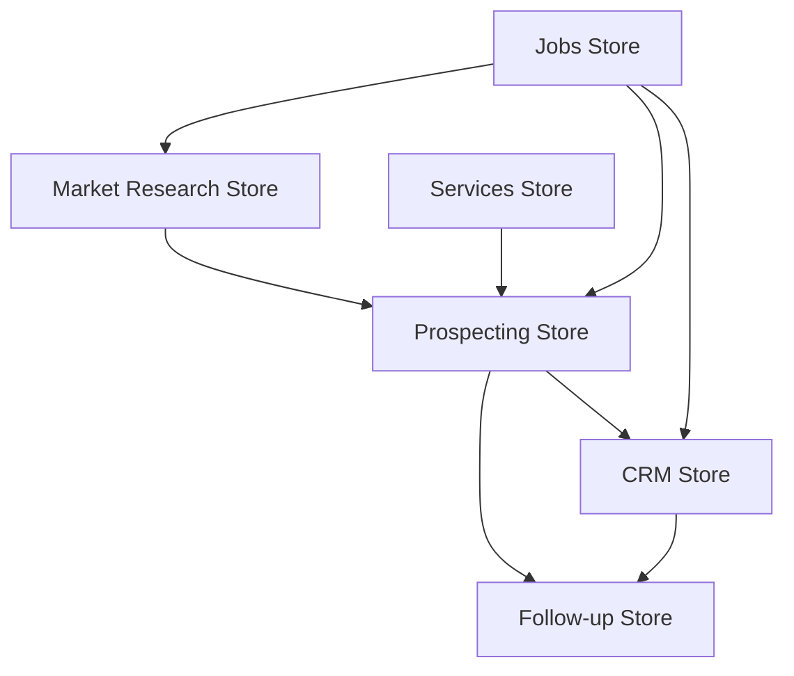

# Store Refactoring Plan

**Task 18 - Phase 4: Store Refactoring**

## Current Store Structure

### Existing Stores

1. **`src/modules/prospecting/prospecting-store.ts`** ✅
   - Already modular
   - Handles: leads, search, filters, actions
   - Status: **Good** - No refactoring needed

2. **`src/modules/followup/followup-store.ts`** ✅
   - Already modular
   - Handles: follow-up queue, rules
   - Status: **Good** - No refactoring needed

3. **`src/modules/crm/calendar-store.ts`** ✅
   - Already modular
   - Handles: calendar events, tasks
   - Status: **Good** - No refactoring needed

4. **`src/modules/services/services-store.ts`** ✅
   - Already modular
   - Handles: services catalog, packages
   - Status: **Good** - No refactoring needed

### Missing Stores

1. **CRM Store** ❌
   - Currently: Logic scattered across components
   - Needs: `src/modules/crm/crm-store.ts`
   - Should handle:
     - Pipeline management
     - Lead updates
     - Activity tracking
     - Task management
     - Notifications

2. **Market Research Store** ❌
   - Currently: Logic in components
   - Needs: `src/modules/market-research/market-research-store.ts`
   - Should handle:
     - Research history
     - Active research
     - Saved reports
     - Filters

3. **Jobs Store** ❌
   - Currently: Logic scattered
   - Needs: `src/modules/jobs/jobs-store.ts`
   - Should handle:
     - Active jobs
     - Job history
     - Job status polling
     - Job cancellation

## Analysis Summary

### ✅ Good News
- **4 stores already modular** and well-structured
- No monolithic store to refactor
- Clean separation of concerns

### 🔨 Work Needed
- **Create 3 new stores** for missing modules
- **Migrate logic** from components to stores
- **Add tests** for new stores

## Refactoring Strategy

### Phase 1: Create CRM Store
**Priority**: High  
**Complexity**: Medium  
**Files affected**: ~10

**Actions**:
1. Create `src/modules/crm/crm-store.ts`
2. Define state interface
3. Implement actions (CRUD, pipeline, tasks)
4. Migrate logic from CRM components
5. Update components to use store

### Phase 2: Create Market Research Store
**Priority**: Medium  
**Complexity**: Low  
**Files affected**: ~5

**Actions**:
1. Create `src/modules/market-research/market-research-store.ts`
2. Define state interface
3. Implement actions (research, history, reports)
4. Migrate logic from components
5. Update components to use store

### Phase 3: Create Jobs Store
**Priority**: Medium  
**Complexity**: Low  
**Files affected**: ~8

**Actions**:
1. Create `src/modules/jobs/jobs-store.ts`
2. Define state interface
3. Implement actions (create, poll, cancel)
4. Migrate logic from components
5. Update components to use store

## Store Dependencies



**Dependencies**:
- CRM Store depends on Prospecting Store (lead data)
- Follow-up Store depends on Prospecting and CRM
- Jobs Store is independent but used by all modules

## State Structure Recommendations

### CRM Store
```typescript
interface CRMState {
  // Pipeline
  pipelineStages: PipelineStage[];
  pipelineStats: PipelineStatistics;
  
  // Activities
  activities: CRMActivity[];
  recentActivities: CRMActivity[];
  
  // Tasks
  tasks: CRMTask[];
  tasksByLead: Record<string, CRMTask[]>;
  
  // Notifications
  notifications: CRMNotification[];
  unreadCount: number;
  
  // UI State
  selectedLeadId?: string;
  activeView: 'pipeline' | 'calendar' | 'tasks';
  filters: LeadFilterCriteria;
  
  // Actions
  updatePipeline: (leadId: string, stage: PipelineStage) => Promise<void>;
  createActivity: (activity: CRMActivity) => Promise<void>;
  createTask: (task: CRMTask) => Promise<void>;
  markNotificationRead: (id: string) => void;
  // ... more actions
}
```

### Market Research Store
```typescript
interface MarketResearchState {
  // Research
  currentResearch?: MarketResearchReport;
  isLoading: boolean;
  
  // History
  history: MarketResearchReport[];
  savedReports: MarketResearchReport[];
  
  // UI State
  filters: {
    dateRange?: { from: string; to: string };
    topics?: string[];
  };
  
  // Actions
  performResearch: (input: string, context?: ResearchContext) => Promise<void>;
  saveReport: (report: MarketResearchReport) => void;
  deleteReport: (id: string) => void;
  loadHistory: () => Promise<void>;
  // ... more actions
}
```

### Jobs Store
```typescript
interface JobsState {
  // Jobs
  activeJobs: Job[];
  jobHistory: Job[];
  
  // Polling
  isPolling: boolean;
  pollInterval: number;
  
  // UI State
  selectedJobId?: string;
  filters: {
    type?: string[];
    status?: string[];
  };
  
  // Actions
  createJob: (payload: JobPayload) => Promise<Job>;
  cancelJob: (id: string) => Promise<void>;
  retryJob: (id: string) => Promise<void>;
  startPolling: () => void;
  stopPolling: () => void;
  loadHistory: () => Promise<void>;
  // ... more actions
}
```

## Implementation Checklist

### CRM Store
- [ ] Create store file
- [ ] Define state interface
- [ ] Implement pipeline actions
- [ ] Implement activity actions
- [ ] Implement task actions
- [ ] Implement notification actions
- [ ] Add persistence (localStorage)
- [ ] Add Supabase integration
- [ ] Write unit tests
- [ ] Update CRMPage.tsx
- [ ] Update CRMCalendar.tsx
- [ ] Update FollowupRulesPanel.tsx

### Market Research Store
- [ ] Create store file
- [ ] Define state interface
- [ ] Implement research actions
- [ ] Implement history actions
- [ ] Add persistence (localStorage)
- [ ] Write unit tests
- [ ] Update market-research.tsx
- [ ] Update MarketResearchInput.tsx
- [ ] Update MarketResearchHistory.tsx

### Jobs Store
- [ ] Create store file
- [ ] Define state interface
- [ ] Implement job actions
- [ ] Implement polling logic
- [ ] Add persistence (localStorage)
- [ ] Write unit tests
- [ ] Update BackgroundJobBanner.tsx
- [ ] Update JobHistoryList.tsx
- [ ] Update dev.jobs.tsx

## Benefits

✅ **Centralized State**: All state in one place per module  
✅ **Type Safety**: Full TypeScript support  
✅ **Testability**: Easy to unit test  
✅ **Reusability**: Share logic across components  
✅ **Performance**: Optimized re-renders  
✅ **Maintainability**: Clear separation of concerns  

## Timeline

- **Week 1**: CRM Store (3-4 days)
- **Week 2**: Market Research Store (1-2 days)
- **Week 2**: Jobs Store (1-2 days)
- **Week 2**: Testing and refinement (2 days)

**Total**: ~2 weeks

## Conclusion

The project is already well-structured with modular stores. The main work is creating 3 new stores for modules that currently lack them. This is a **medium-complexity** refactoring that will significantly improve code organization and maintainability.
